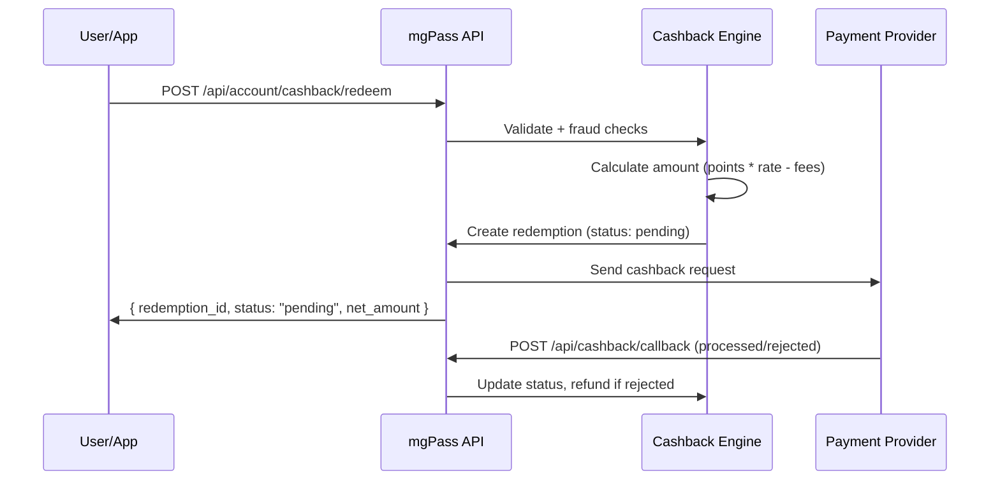

## Overview

Users can convert their points to mobile money (GHS) sent directly to their phone. This is the primary redemption path for the mgPass rewards program.

## How Cashback Works



## Initiating a Cashback

```bash
curl -X POST https://pass.mediageneral.digital/api/account/cashback/redeem \
  -H "Authorization: Bearer USER_TOKEN" \
  -H "Content-Type: application/json" \
  -d '{
    "points": 1000,
    "phone_number": "+233241234567",
    "network": "mtn"
  }'
```

### Response

```json
{
  "redemption_id": "rdm_abc123",
  "status": "pending",
  "points": 1000,
  "tier": "silver",
  "rate": 0.05,
  "gross_amount": 50.00,
  "fee_rate": 0.02,
  "fee_amount": 1.00,
  "net_amount": 49.00
}
```

## Calculation

```
gross_amount = points * tier_rate
fee_amount = gross_amount * processing_fee_rate
net_amount = gross_amount - fee_amount
```

### Example

| Field | Value |
|-------|-------|
| Points | 1,000 |
| Tier | Silver |
| Rate | 0.05 GHS/point |
| Gross | 50.00 GHS |
| Fee Rate | 2% |
| Fee | 1.00 GHS |
| **Net (sent to user)** | **49.00 GHS** |

Rates and fees are configured per tier by MG Digital admins.

## Supported Networks

| Network | Value |
|---------|-------|
| MTN Mobile Money | `mtn` |
| Telecel Cash | `telecel` |
| AirtelTigo Money | `airteltigo` |

## Fraud Protection

The cashback engine enforces several safety checks:

| Check | Default | Description |
|-------|---------|-------------|
| Minimum points | 250 | Minimum points to redeem |
| Max daily redemptions | 3 | Per user per day |
| Max daily amount | 500 GHS | Total cashback per user per day |
| Cooldown | 60 min | Minimum wait between redemptions |

If any check fails, you'll receive a `429` response:

```json
{
  "error": "fraud_check_failed",
  "message": "Please wait 45 minutes before your next cashback redemption"
}
```

## Redemption Status

| Status | Description |
|--------|-------------|
| `pending` | Created, awaiting processing |
| `processing` | Sent to payment provider |
| `completed` | Cash delivered to user |
| `failed` | Payment provider rejected -- points refunded |
| `cancelled` | Cancelled by admin -- points refunded |

## Callback (Payment Provider)

The payment provider sends a callback when the transfer completes:

```json
POST /api/cashback/callback

{
  "cashback_ID": "rdm_abc123",
  "status": "processed",
  "reason": null
}
```

On `rejected` status, points are automatically refunded to the user's balance.

<Warning>
  The callback endpoint is unauthenticated. In production, implement IP allowlisting for your payment provider.
</Warning>

## Tracking Redemptions

Users can check their redemption history:

```bash
curl https://pass.mediageneral.digital/api/account/rewards/redemptions \
  -H "Authorization: Bearer USER_TOKEN"
```
