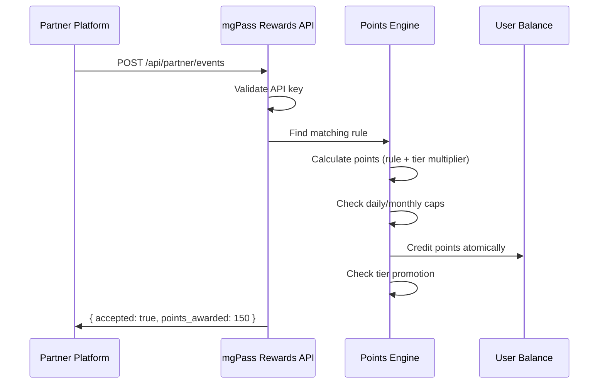

## What is mgPass Rewards?

mgPass Rewards is the loyalty engine behind the MG Digital ecosystem. It enables any platform -- adesa+, 3News, mgTix, or third-party partners -- to award points to users for engagement, purchases, and activity.

Users earn points across all connected platforms, accumulate tier status, and redeem rewards through the catalog or as mobile money cashback.

## Key Concepts

<CardGroup cols={2}>
  <Card title="Points" icon="coins">
    The base currency. Users earn points through events published by platforms and partners. Points can be redeemed for catalog items or converted to mobile money.
  </Card>
  <Card title="Tiers" icon="layer-group">
    Users progress through tiers (Bronze, Silver, Gold, Platinum) based on lifetime earned points. Higher tiers unlock better multipliers and exclusive benefits.
  </Card>
  <Card title="Rules" icon="gears">
    Configurable rules determine how many points each event type awards. Rules can vary by platform, tier, and can include daily/monthly caps.
  </Card>
  <Card title="Partners" icon="handshake">
    External platforms integrate via API key authentication to publish events and award points to shared users.
  </Card>
</CardGroup>

## How It Works

## Integration Options

| Audience | Authentication | Base Path |
|----------|---------------|-----------|
| **Partners** (external platforms) | `X-API-Key` header | `/api/partner/` |
| **Users** (mobile/web apps) | OAuth 2.0 Bearer token | `/api/account/` |
| **Admins** (mgPass console) | Bearer token with `mgpass:admin` scope | `/api/rewards/` |

## Environments

| Environment | Base URL |
|-------------|----------|
| Production | `https://pass.mediageneral.digital` |
| Staging | `https://pass.mgdm.dev` |

## Next Steps

<CardGroup cols={2}>
  <Card title="Quickstart" icon="rocket" href="/guides/quickstart">
    Get your first event published in 5 minutes
  </Card>
  <Card title="Partner Integration" icon="plug" href="/guides/partner-integration">
    Full guide for external partners
  </Card>
</CardGroup>
