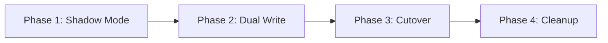

## Overview

This guide covers migrating from a Logto-based authentication system to mgPass. The migration strategy uses a dual-write shadow mode to ensure zero downtime.

## Migration Strategy

### Phase 1: Shadow Mode

Run mgPass alongside Logto, mirroring all write operations to mgPass without serving reads from it.

- Import existing users into mgPass
- Configure mgPass with the same signing keys for session continuity
- Shadow-write new registrations and profile updates to both systems
- Validate data consistency between Logto and mgPass

### Phase 2: Dual Write

Both systems are active. Reads gradually shift to mgPass via feature flags.

- Enable dual-write for all user operations
- Use KV-based feature flags to route a percentage of traffic to mgPass
- Monitor error rates and latency
- Gradually increase mgPass traffic percentage

### Phase 3: Cutover

mgPass becomes the primary authentication system.

- Route 100% of traffic to mgPass
- Keep Logto running as a fallback (read-only)
- Monitor for 48-72 hours
- Disable Logto write path

### Phase 4: Cleanup

Remove Logto dependencies.

- Decommission Logto instance
- Remove dual-write code
- Clean up feature flags

## User Data Mapping

| Logto Field | mgPass Field | Notes |
|-------------|-------------|-------|
| `id` | `id` | Preserve original IDs |
| `primaryEmail` | `email` | Direct mapping |
| `primaryPhone` | `phone` | Direct mapping |
| `username` | `name` | May need transformation |
| `avatar` | `avatar` | URL reference |
| `isSuspended` | `is_suspended` | Boolean mapping |
| `customData` | `metadata` | JSON field |
| `identities` | Social identities table | Flatten and re-link |

## Password Handling

Logto uses Argon2 for password hashing. Since password hashes cannot be exported directly:

1. Import users without passwords
2. On first login attempt, prompt the user to set a new password
3. Alternatively, send a password reset email to all migrated users

<Warning>
Users migrated without passwords will need to authenticate via social login or complete a password reset flow on their first sign-in to mgPass.
</Warning>

## Points and Rewards Data

Rewards data migration is straightforward since it lives in D1:

1. Export the points ledger from the source system
2. Import ledger entries preserving timestamps and reference IDs
3. Use the `total_points` field from the user record as the authoritative balance (not a ledger recalculation)
4. Verify tier assignments match expected values

<Note>
Always use the stored `total_points` value for balance migration, not a recalculated sum from the ledger. This avoids discrepancies from expired or voided entries.
</Note>

## Signing Key Import

For session continuity during migration, import Logto's JWT signing keys into mgPass:

1. Export the RSA private key from Logto
2. Import it into mgPass via the admin console
3. mgPass will use the imported key to validate existing tokens
4. New tokens are signed with mgPass's own key
5. As old tokens expire, all active tokens will use the new key

## Verification Checklist

Before completing the cutover:

- All users can sign in (email/password and social)
- Token validation works for both Logto-issued and mgPass-issued tokens
- Points balances match between systems
- Webhooks are firing correctly
- Admin console shows all users and data
- Audit logs are capturing events
