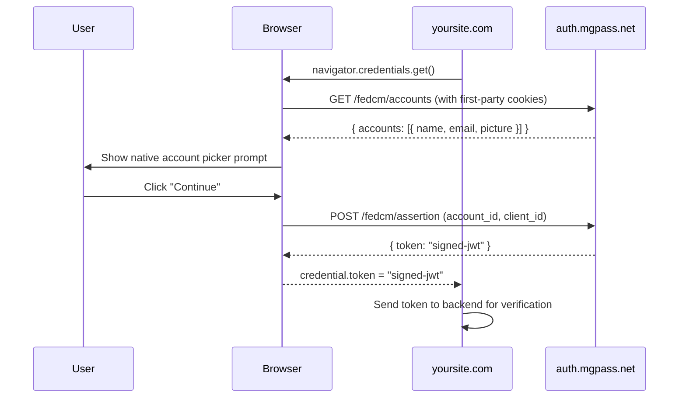

## Overview

mgPass uses **FedCM (Federated Credential Management)** for cross-domain SSO. FedCM is a W3C standard browser API where the browser itself mediates the identity check -- no iframes, no third-party cookies, no custom UI.

When a user has an active mgPass session, the browser shows a native account picker prompt. The user clicks "Continue" and receives a signed JWT token -- zero friction, zero redirect chains.

<CardGroup cols={2}>
  <Card title="Browser-native" icon="globe">
    The browser mediates the entire identity flow. No custom UI, no iframes, no popups.
  </Card>
  <Card title="Zero friction" icon="bolt">
    Users click once on the native browser prompt to authenticate. No login form, no password entry.
  </Card>
  <Card title="No third-party cookies" icon="shield">
    FedCM works without third-party cookies. Future-proof against browser privacy changes.
  </Card>
  <Card title="Invisible when inactive" icon="eye-slash">
    If the user has no mgPass session, nothing is shown. Your page is unaffected.
  </Card>
</CardGroup>

---

## What is FedCM

FedCM (Federated Credential Management) is a W3C standard browser API for identity federation. Instead of relying on iframes, redirects, or third-party cookies, the browser itself acts as the intermediary between the identity provider and the relying party.

Key properties:

- The browser calls the identity provider's endpoints directly with first-party cookies
- The user sees a native browser prompt (not a custom UI)
- No third-party cookies are needed -- works in all privacy modes
- The identity provider never sees which site the user is visiting until the user consents

### Browser Support

| Browser | Support |
|---------|---------|
| Chrome 108+ | Fully supported |
| Edge 108+ | Fully supported |
| Firefox | Behind flag |
| Safari | In development |

---

## How It Works

<Steps>
  <Step title="Partner site requests credentials">
    Your site calls `navigator.credentials.get()` with the mgPass FedCM configuration, or loads the mgPass SDK which does this automatically.
  </Step>

  <Step title="Browser checks for active session">
    The browser calls `auth.mgpass.net/fedcm/accounts` with first-party cookies. This happens in the browser's internal network stack -- no JavaScript is involved.
  </Step>

  <Step title="Native prompt shown">
    If the user has an active mgPass session, the browser displays a native account picker showing the user's name, email, and avatar. If no session exists, nothing happens.
  </Step>

  <Step title="User consents">
    The user clicks "Continue" on the native browser prompt.
  </Step>

  <Step title="Token issued">
    The browser calls `auth.mgpass.net/fedcm/assertion` with the selected account and your client ID. mgPass issues a signed JWT token.
  </Step>

  <Step title="Token delivered to your site">
    The browser passes the JWT token back to your JavaScript callback. Your site sends the token to your backend for verification.
  </Step>
</Steps>



---

## Quick Start (Using SDK)

The mgPass SDK wraps the FedCM API with automatic fallback for unsupported browsers.

```html
<script src="https://auth.mgpass.net/sdk/onetap.js"></script>
<script>
  mgpass.onetap({
    client_id: 'your_client_id',
    callback: function(token) {
      // Send token to your backend to verify
      fetch('/api/auth/fedcm', {
        method: 'POST',
        headers: { 'Content-Type': 'application/json' },
        body: JSON.stringify({ token: token })
      });
    }
  });
</script>
```

---

## Quick Start (Direct API)

You can call the FedCM API directly without the SDK:

```javascript
const credential = await navigator.credentials.get({
  identity: {
    providers: [{
      configURL: 'https://auth.mgpass.net/fedcm/config.json',
      clientId: 'your_client_id'
    }]
  }
});

if (credential) {
  // credential.token is a JWT signed by mgPass
  const response = await fetch('/api/auth/verify', {
    method: 'POST',
    body: JSON.stringify({ token: credential.token })
  });
}
```

---

## Token Verification (Backend)

The FedCM flow delivers a signed JWT token to your frontend. Verify it on your backend before creating a session:

```javascript
import * as jose from 'jose';

const JWKS = jose.createRemoteJWKSet(
  new URL('https://auth.mgpass.net/.well-known/jwks.json')
);

const { payload } = await jose.jwtVerify(token, JWKS, {
  issuer: 'https://auth.mgpass.net',
  audience: 'your_client_id'
});

// payload.sub = user ID
// payload.scope = granted scopes
```

<Warning>
Always verify the token on your backend. Never trust the JWT payload on the client side without server-side verification.
</Warning>

---

## FedCM Endpoints

These endpoints are called by the browser during the FedCM flow. You do not call them directly -- they are listed here for reference.

| Endpoint | Purpose |
|----------|---------|
| `/.well-known/web-identity` | FedCM provider discovery |
| `/fedcm/config.json` | IdP configuration |
| `/fedcm/accounts` | Returns logged-in user accounts |
| `/fedcm/assertion` | Issues JWT token |
| `/fedcm/client-metadata` | RP terms/privacy URLs |

See the [API Reference](/api-reference/authentication/fedcm-discovery) for full endpoint documentation.

---

## Fallback for Unsupported Browsers

FedCM is not yet supported in all browsers. Use the standard OAuth redirect flow as a fallback:

```javascript
if (!window.IdentityCredential) {
  // FedCM not supported -- fall back to OAuth redirect
  window.location.href = 'https://auth.mgpass.net/authorize?' +
    new URLSearchParams({
      response_type: 'code',
      client_id: 'your_client_id',
      redirect_uri: 'https://yoursite.com/callback',
      scope: 'openid profile email'
    });
}
```

<Note>
The mgPass SDK (`onetap.js`) handles this fallback automatically. If FedCM is not available, the SDK falls back to the OAuth redirect flow.
</Note>

---

## Security

<AccordionGroup>
  <Accordion title="Browser-mediated flow">
    The browser itself mediates the entire identity flow. Your site never communicates directly with the identity provider during the credential check -- the browser handles all network requests internally.
  </Accordion>

  <Accordion title="User consent required">
    The browser always shows a native prompt before sharing any identity information. The identity provider does not learn which site the user is visiting until the user explicitly consents.
  </Accordion>

  <Accordion title="No third-party cookies">
    FedCM uses first-party cookies on the identity provider's origin. It works regardless of third-party cookie blocking settings (Safari ITP, Firefox ETP, Chrome Privacy Sandbox).
  </Accordion>

  <Accordion title="Signed JWT tokens">
    The assertion endpoint issues a JWT signed with the mgPass signing key. Verify the signature and claims on your backend using the published JWKS endpoint.
  </Accordion>

  <Accordion title="Client ID validation">
    The FedCM assertion endpoint validates the `client_id` against registered applications. Tokens are audience-bound -- a token issued for one client cannot be used by another.
  </Accordion>
</AccordionGroup>

---

## Next Steps

- [SSO Guide](/guides/sso) -- understand same-domain and cross-domain SSO architecture
- [OAuth Flows](/guides/oauth-flows) -- full details on the authorization code flow
- [Token Refresh](/guides/token-refresh) -- keep users authenticated with automatic token renewal
