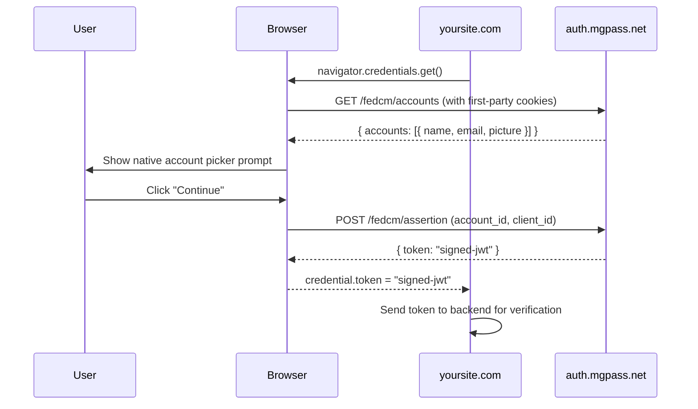

## Overview

mgPass uses **FedCM (Federated Credential Management)** for cross-domain SSO. FedCM is a W3C standard browser API where the browser itself mediates the identity check -- no iframes, no third-party cookies, no custom UI.

When a user has an active mgPass session, the browser shows a native account picker prompt. The user clicks "Continue" and receives a signed JWT token -- zero friction, zero redirect chains.

<CardGroup cols={2}>
  <Card title="Browser-native" icon="globe">
    The browser mediates the entire identity flow. No custom UI, no iframes, no popups.
  </Card>
  <Card title="Zero friction" icon="bolt">
    Users click once on the native browser prompt to authenticate. No login form, no password entry.
  </Card>
  <Card title="No third-party cookies" icon="shield">
    FedCM works without third-party cookies. Future-proof against browser privacy changes.
  </Card>
  <Card title="Invisible when inactive" icon="eye-slash">
    If the user has no mgPass session, nothing is shown. Your page is unaffected.
  </Card>
</CardGroup>

---

## What is FedCM

FedCM (Federated Credential Management) is a W3C standard browser API for identity federation. Instead of relying on iframes, redirects, or third-party cookies, the browser itself acts as the intermediary between the identity provider and the relying party.

Key properties:

- The browser calls the identity provider's endpoints directly with first-party cookies
- The user sees a native browser prompt (not a custom UI)
- No third-party cookies are needed -- works in all privacy modes
- The identity provider never sees which site the user is visiting until the user consents

### Browser Support

| Browser | Support |
|---------|---------|
| Chrome / Edge 136+ | Fully supported (native one-tap prompt) |
| Other Chromium (Opera, Samsung Internet) | Supported |
| Firefox | Not shipped (implementation paused) |
| Safari | Not supported (no implementation planned) |

FedCM is Chromium-only today. For Safari and Firefox, the SDK shows a redirect
fallback instead (see [Fallback for unsupported browsers](#fallback-for-unsupported-browsers)) — so configure `login_url` to support every browser.

---

## How It Works

<Steps>
  <Step title="Partner site requests credentials">
    Your site calls `navigator.credentials.get()` with the mgPass FedCM configuration, or loads the mgPass SDK which does this automatically.
  </Step>

  <Step title="Browser checks for active session">
    The browser calls `auth.mgpass.net/fedcm/accounts` with first-party cookies. This happens in the browser's internal network stack -- no JavaScript is involved.
  </Step>

  <Step title="Native prompt shown">
    If the user has an active mgPass session, the browser displays a native account picker showing the user's name, email, and avatar. If no session exists, nothing happens.
  </Step>

  <Step title="User consents">
    The user clicks "Continue" on the native browser prompt.
  </Step>

  <Step title="Token issued">
    The browser calls `auth.mgpass.net/fedcm/assertion` with the selected account and your client ID. mgPass issues a signed JWT token.
  </Step>

  <Step title="Token delivered to your site">
    The browser passes the JWT token back to your JavaScript callback. Your site sends the token to your backend for verification.
  </Step>
</Steps>


```mermaid
sequenceDiagram
    participant User
    participant Browser
    participant Site as yoursite.com
    participant Auth as auth.mgpass.net

    Site->>Browser: navigator.credentials.get()
    Browser->>Auth: GET /fedcm/accounts (with first-party cookies)
    Auth-->>Browser: { accounts: [{ name, email, picture }] }
    Browser->>User: Show native account picker prompt
    User->>Browser: Click "Continue"
    Browser->>Auth: POST /fedcm/assertion (account_id, client_id)
    Auth-->>Browser: { token: "signed-jwt" }
    Browser-->>Site: credential.token = "signed-jwt"
    Site->>Site: Send token to backend for verification
```

---

## Quick Start (Using SDK)

The mgPass SDK wraps the FedCM API and shows a redirect fallback on browsers
without FedCM (Safari, Firefox).

```html
<script src="https://auth.mgpass.net/sdk/onetap.js"></script>
<script>
  mgpass.onetap({
    client_id: 'your_client_id',

    // Chromium: called with a signed JWT when the user taps the native prompt.
    callback: function(token) {
      // Send token to your backend to verify (see "Token Verification" below).
      fetch('/api/auth/fedcm', {
        method: 'POST',
        headers: { 'Content-Type': 'application/json' },
        body: JSON.stringify({ token: token })
      });
    },

    // Safari / Firefox / FedCM-disabled Chrome: the SDK shows a
    // "Continue with mgPass" card whose button navigates here. Point it at the
    // page on YOUR site that starts the normal OAuth login (with state + PKCE),
    // e.g. your "Sign in" route. Omit it to disable the fallback card.
    login_url: '/sign-in'
  });
</script>
```

<ParamField path="client_id" type="string" required>
  Your registered mgPass application (client) ID.
</ParamField>
<ParamField path="callback" type="function">
  Receives the signed FedCM JWT (Chromium path). POST it to your backend to verify and create a session.
</ParamField>
<ParamField path="login_url" type="string">
  URL on your own site that initiates the standard OAuth/SSO redirect. Used by the non-FedCM fallback card. No card is shown if omitted.
</ParamField>

<Info>
The fallback's `login_url` should point at your existing login route (the one that
generates `state` + PKCE and redirects to `/authorize`) — **not** directly at
`auth.mgpass.net/authorize` — so the callback's CSRF/state checks still pass.
</Info>

---

## Quick Start (Direct API)

You can call the FedCM API directly without the SDK:

```javascript
const credential = await navigator.credentials.get({
  identity: {
    providers: [{
      configURL: 'https://auth.mgpass.net/fedcm/config.json',
      clientId: 'your_client_id'
    }]
  }
});

if (credential) {
  // credential.token is a JWT signed by mgPass
  const response = await fetch('/api/auth/verify', {
    method: 'POST',
    body: JSON.stringify({ token: credential.token })
  });
}
```

---

## Token Verification (Backend)

The FedCM flow delivers a signed JWT token to your frontend. Verify it on your backend before creating a session:

```javascript
import * as jose from 'jose';

const JWKS = jose.createRemoteJWKSet(
  new URL('https://auth.mgpass.net/.well-known/jwks.json')
);

const { payload } = await jose.jwtVerify(token, JWKS, {
  issuer: 'https://auth.mgpass.net',
  audience: 'your_client_id'
});

// payload.sub = user ID
// payload.scope = granted scopes
```

<Warning>
Always verify the token on your backend. Never trust the JWT payload on the client side without server-side verification.
</Warning>

---

## FedCM Endpoints

These endpoints are called by the browser during the FedCM flow. You do not call them directly -- they are listed here for reference.

| Endpoint | Purpose |
|----------|---------|
| `/.well-known/web-identity` | FedCM provider discovery |
| `/fedcm/config.json` | IdP configuration |
| `/fedcm/accounts` | Returns logged-in user accounts |
| `/fedcm/assertion` | Issues JWT token |
| `/fedcm/client-metadata` | RP terms/privacy URLs |

See the [API Reference](/api-reference/authentication/fedcm-discovery) for full endpoint documentation.

---

## Fallback for unsupported browsers

FedCM is Chromium-only. On Safari and Firefox the mgPass SDK automatically shows
a small **"Continue with mgPass"** card whose button navigates to the `login_url`
you configured. Point `login_url` at your normal OAuth login route (the one that
generates `state` + PKCE and redirects to `/authorize`) and you're done — no
extra code:

```html
<script src="https://auth.mgpass.net/sdk/onetap.js"></script>
<script>
  mgpass.onetap({
    client_id: 'your_client_id',
    callback: handleToken,   // Chromium / FedCM path
    login_url: '/sign-in'    // fallback for everyone else
  });
</script>
```

<Warning>
If you build the fallback yourself instead of using `login_url`, route the user
through your **own** login endpoint (which sets `state` + PKCE) — do **not** link
straight to `auth.mgpass.net/authorize`, or your `/callback` state check will
reject the response. See [OAuth Flows](/guides/oauth-flows).
</Warning>

<Note>
The card is dismissible (per browser session) and is never shown if you omit `login_url`.
</Note>

---

## Security

<AccordionGroup>
  <Accordion title="Browser-mediated flow">
    The browser itself mediates the entire identity flow. Your site never communicates directly with the identity provider during the credential check -- the browser handles all network requests internally.
  </Accordion>

  <Accordion title="User consent required">
    The browser always shows a native prompt before sharing any identity information. The identity provider does not learn which site the user is visiting until the user explicitly consents.
  </Accordion>

  <Accordion title="No third-party cookies">
    FedCM uses first-party cookies on the identity provider's origin. It works regardless of third-party cookie blocking settings (Safari ITP, Firefox ETP, Chrome Privacy Sandbox).
  </Accordion>

  <Accordion title="Signed JWT tokens">
    The assertion endpoint issues a JWT signed with the mgPass signing key. Verify the signature and claims on your backend using the published JWKS endpoint.
  </Accordion>

  <Accordion title="Client ID validation">
    The FedCM assertion endpoint validates the `client_id` against registered applications. Tokens are audience-bound -- a token issued for one client cannot be used by another.
  </Accordion>
</AccordionGroup>

---

## Next Steps

- [SSO Guide](/guides/sso) -- understand same-domain and cross-domain SSO architecture
- [OAuth Flows](/guides/oauth-flows) -- full details on the authorization code flow
- [Token Refresh](/guides/token-refresh) -- keep users authenticated with automatic token renewal
