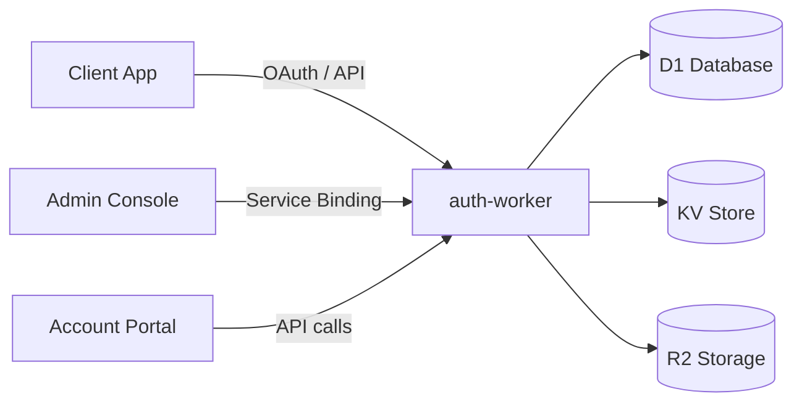

## Overview

mgPass is an identity and loyalty platform purpose-built for the MG Digital ecosystem. It handles authentication, authorization, user management, and rewards across all MG Digital products including adesa+, 3News, and partner integrations.

## Architecture

mgPass runs entirely on Cloudflare's edge infrastructure:

### Three Surfaces

| Service | Purpose | Domain |
|---------|---------|--------|
| **auth-worker** | Core API — OAuth, users, RBAC, rewards | `pass.mediageneral.digital` |
| **admin console** | SSR admin dashboard for operators | `admin.mgdm.dev` (staging) |
| **account portal** | User self-service (profile, sessions, rewards) | `account.mgdm.dev` (staging) |

### Infrastructure

- **Cloudflare Workers** — Serverless compute at the edge
- **D1** — SQLite-compatible relational database for all persistent data
- **KV** — Key-value store for sessions, caching, and feature flags
- **R2** — Object storage for user avatars and uploaded assets

## Core Concepts

### Users
Every person in the system has a user record with a unique ID, profile data (name, email, phone, avatar), and authentication credentials. Users can sign in with email/password or linked social accounts.

### Applications (OAuth Clients)
External applications register as OAuth clients to authenticate users. Each app has a client ID, secret, redirect URIs, and configured scopes. App types include Traditional Web, SPA, Native/Mobile, and Machine-to-Machine.

### API Resources and Scopes
API resources represent protected APIs (e.g., `https://api.adesa.plus`). Each resource defines scopes — granular permissions like `stream:live` or `content:read`. Scopes appear in JWT access tokens.

### Roles
Roles are named collections of scopes. Assign roles to users to grant permissions across multiple API resources. Roles can be marked as default (auto-assigned to new users) or restricted to M2M clients.

### Organizations
Organizations represent tenants — partner companies, enterprise clients, or business units. Members can have organization-scoped roles that are separate from their global roles.

### Rewards
The loyalty engine lets partners award points to users based on configurable rules. Points accumulate toward tier upgrades and can be redeemed for catalog items or mobile money cashback.

## API Authentication

mgPass uses three authentication methods:

<AccordionGroup>
  <Accordion title="OAuth 2.0 Bearer Token">
    Used by client applications to access user data and perform user-scoped operations. Obtained through the standard OAuth 2.0 authorization code flow.
  </Accordion>
  <Accordion title="Admin Bearer Token">
    Bearer tokens with the `mgpass:admin` scope, used by the admin console and administrative API clients. Required for all management endpoints.
  </Accordion>
  <Accordion title="Partner API Key">
    Static API keys issued to reward partners, sent via the `X-API-Key` header. Used exclusively for the partner events endpoint.
  </Accordion>
</AccordionGroup>

## Base URLs

| Environment | URL |
|-------------|-----|
| Production | `https://pass.mediageneral.digital` |
| Staging | `https://pass.mgdm.dev` |

## Next Steps

<CardGroup cols={2}>
  <Card title="OAuth Flows" icon="key" href="/guides/oauth-flows">
    Implement authentication in your application
  </Card>
  <Card title="Register an App" icon="grid-2" href="/guides/applications">
    Set up your OAuth client
  </Card>
</CardGroup>
