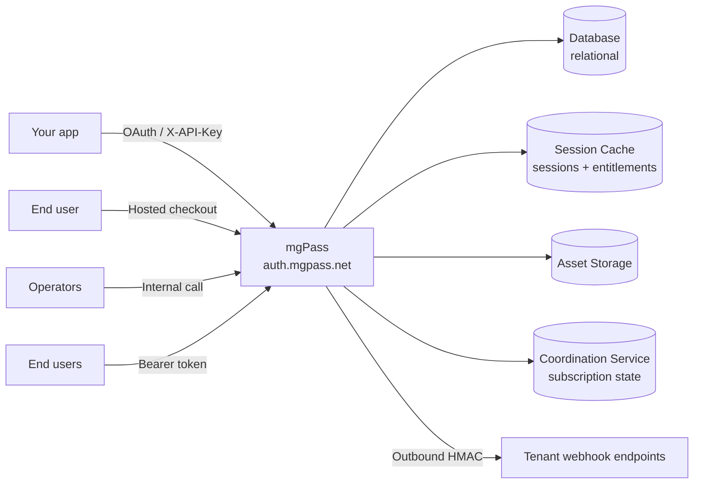

## What mgPass is

mgPass is the identity, payments, subscriptions, and rewards platform behind MG Digital. An [Application](/guides/applications) can sign users in, take a one-off payment, sell a subscription, and award points — all behind a single management API and a single per-integration record.

## Architecture

mgPass is built from a core service backed by a durable database, a fast cache layer, asset storage, and a per-subscription coordination service:

```mermaid
graph LR
    Client[Your app] -->|OAuth / X-API-Key| MGP[mgPass<br/>auth.mgpass.net]
    Pay[End user] -->|Hosted checkout| MGP
    Operator[Operators] -->|Internal call| MGP
    Account[End users] -->|Bearer token| MGP
    MGP --> DB[(Database<br/>relational)]
    MGP --> CACHE[(Session Cache<br/>sessions + entitlements)]
    MGP --> ASSETS[(Asset Storage)]
    MGP --> COORD[(Coordination Service<br/>subscription state)]
    MGP -->|Outbound HMAC| Webhooks[Tenant webhook endpoints]
```

### Four surfaces

| Service | Domain | Purpose |
|---------|--------|---------|
| **mgPass API** | `auth.mgpass.net` | Core API — OAuth, users, Applications, Payments, Subscriptions, Rewards, webhook delivery, SDK bundle, hosted checkout route |
| **Hosted checkout** | `pay.mgpass.net` | Public `/checkout/:sessionId` page rendered by the mgPass service for redirect-style flows |
| **developer console** | `console.mgpass.net` | Self-serve dashboard — register Applications, configure plans, subscriptions, payments, webhooks, OAuth credentials, branding |
| **account portal** | `mgpass.net` | End-user self-service — profile, sessions, subscriptions, notifications, rewards |

### Infrastructure

- **The mgPass service** for compute.
- **A relational database** for durable data (users, applications, plans, subscriptions, ledger).
- **A fast cache layer** for sessions, entitlement caches, and feature flags.
- **Asset storage** for uploaded assets.
- **A coordination service** for the per-subscription state machine that gates renewals.
- **Background retries** for webhook delivery and subscription renewals.

## Core concepts

### Applications (v3 unified model)

Every integration — a web app, a storefront, a billing product — is one [Application](/guides/applications). That record carries the integration's slug, name, branding, and organization. Capabilities are attached to it:

- **OAuth** — sign users in (redirect URIs, scopes, token lifetimes, refresh-token rotation).
- **Payments** — charge an arbitrary amount once, and settle a share to a third party. Authenticated with `X-API-Key`.
- **Subscriptions** — sell recurring plans (billing email, JWT entitlement mode, allowed widget origins). Authenticated with `X-API-Key`.
- **Rewards** — award points for events you publish (event types, custom rules, points multiplier). Authenticated with `X-API-Key`.

Enable a capability by attaching it; disable it by detaching it. There is no separate OAuth-client id, partner id, or tenant id — those are all an Application. One Application id identifies the integration everywhere in the API.

### Users, roles, scopes

Every person has a user record with profile data and credentials. **Roles** are named collections of **scopes**, and scopes appear in JWT access tokens to gate **API resources** (your protected APIs, e.g. `https://api.yourapp.com`). Roles can be default (auto-assigned), restricted to machine-to-machine clients, or organization-scoped.

### Organizations

Organizations represent tenants — partner companies, enterprise customers, or business units. Members can hold organization-scoped roles separate from their global roles.

### Plans and Subscriptions

A **Plan** is the price + interval + currency + features bundle defined per Application. A **Subscription** binds a user to a plan with a billing cycle, current period, and lifecycle state (`trialing`, `active`, `past_due`, `unpaid`, `cancelled`, `expired`, `paused`). The Subscriptions Engine maintains state in a per-subscription coordination service, charges via the payment provider, and emits webhooks at every transition.

### Checkout sessions

A short-lived record (created via `POST /v1/checkout`) that captures the plan, customer, promo code, mode (`hosted` or `embedded`), and success/cancel URLs. Hosted mode returns a `pay.mgpass.net/checkout/:sessionId` URL; embedded mode is loaded by the `checkout.js` widget in an iframe.

### Sponsored subscriptions

Admin-provisioned subs that skip the payment provider entirely — used for comps, internal access, and partnership grants. Idempotent, excluded from monetary aggregates, and tracked in the same lifecycle as paid subs.

### Notifications inbox

Per-user record of every notification the platform sent (email, SMS, in-app) plus user preferences per category and per surface. The inbox lives in the account portal at `/notifications`.

## The four engines

### Identity & Auth

OAuth 2.0 / OIDC authorization code, PKCE, client credentials, and refresh-token rotation. SMS OTP, social login (Google, Apple, Facebook), MFA (TOTP), SSO, and a One Tap SDK. JWKS, OIDC discovery, FedCM, and a hosted login UI. Configure via the OAuth capability.

### Payments

A capability on an Application, authenticated with `X-API-Key`. It does two things, and neither is a subscription.

**Take a one-off payment.** A single charge for an amount you decide — a ticket, an order, a top-up. `POST /v1/payments` starts it. The buyer gets a payment page, or a prompt on their handset for mobile money when you supply the wallet details. `GET /v1/payments` lists charges, filterable by `status` and `reference`. Confirm with `GET /v1/payments/by-reference/{reference}` using your own reference — that is the recommended confirmation path.

**Pay somebody else.** Money can settle to a third party rather than the platform balance. Register where it goes with `POST /v1/payout-destinations`. List destinations with `GET /v1/payout-destinations`, and look one up with `GET /v1/payout-destinations/by-reference/{reference}`. `PATCH` that path to correct or change the account, or to switch payouts on and off. `DELETE` it to stop payouts. `GET /v1/payout-destinations/resolve` checks whose account a number belongs to before you save it. `GET /v1/banks` lists the banks and mobile-money wallets that can receive settlement.

Mobile money is first-class here, not a fallback. Most Ghanaian buyers pay that way.

See [One-off payments](/guides/one-off-payments).

### Subscriptions Engine

Plans, hosted and embedded checkout, card billing in GHS and USD, promo codes, trials, family / multi-seat plans, sponsored subs, upgrade proration, and renewals driven by per-subscription coordination services. JWT entitlements are signed on demand. Every state transition emits a webhook: `subscription.created`, `.activated`, `.renewed`, `.payment_failed`, `.unpaid`, `.cancelled`, `.expired`, `.trial_ending`, `.plan_changed`. The embed widget (`https://auth.mgpass.net/sdk/checkout.js`) ships with an SRI hash and origin-checks against `allowed_widget_origins` on the Subscriptions capability.

Annual plans are card-only. Mobile money cannot be used for them — document that gap with users on mobile-money-only flows.

### Rewards

A points engine with configurable per-Application rules, awarded against partner-published events (`POST /api/partner/events`). Points accumulate toward tiers, can be redeemed against a catalog, or cashed out to mobile money. Configure via the Rewards capability.

## API authentication

mgPass uses three authentication methods. Pick by who the caller is:

<AccordionGroup>
  <Accordion title="OAuth Bearer access_token — end users">
    Issued by the OAuth flows. Carries user identity and scopes. Use for account self-service endpoints (`/api/account/*`), userinfo, and any user-scoped action your app performs on the user's behalf.
  </Accordion>
  <Accordion title="Admin Bearer token — operators">
    A bearer token issued to admin users via the OAuth flow with the `mgpass:admin` scope. Required for the entire management API: `/api/applications/*`, `/api/users`, `/api/subscriptions/*`, `/api/rewards/*`, audit logs, and so on.
  </Accordion>
  <Accordion title="X-API-Key — tenant / partner servers">
    Static API keys issued per Application capability. Sent in the `X-API-Key` header. Used by tenant-facing v1 endpoints (`/v1/checkout`, `/v1/plans`, `/v1/subscriptions`, `/v1/promo-codes`, `/v1/notifications`, `/v1/payments`, `/v1/payout-destinations`, `/v1/banks`) and the rewards partner events endpoint (`/api/partner/events`).
  </Accordion>
</AccordionGroup>

## Conventions

- **Money is in minor units** (pesewas for GHS, cents for USD) everywhere — request bodies, responses, webhooks.
- **Currency** is always `GHS` or `USD` and travels alongside `amount` on every money-bearing field.
- **Audit event types** follow `{entity}.{sub_entity?}.{action}` in snake_case.
- **Secrets** are returned once when you create or rotate them. They cannot be retrieved later.

## Base URLs

| Environment | URL |
|-------------|-----|
| Production | `https://auth.mgpass.net` |

## Next steps

<CardGroup cols={2}>
  <Card title="One-off payments" icon="money-bill" href="/guides/one-off-payments">
    Charge once, confirm by your own reference, pay a third party.
  </Card>
  <Card title="Subscriptions overview" icon="repeat" href="/guides/subscriptions/overview">
    Tour the Subscriptions Engine end-to-end.
  </Card>
  <Card title="Applications model" icon="grid-2" href="/guides/applications">
    Register an Application and enable capabilities.
  </Card>
  <Card title="OAuth flows" icon="key" href="/guides/oauth-flows">
    Wire up sign-in for your client.
  </Card>
  <Card title="API reference" icon="code" href="/api-reference/introduction">
    Endpoint-by-endpoint reference.
  </Card>
</CardGroup>
