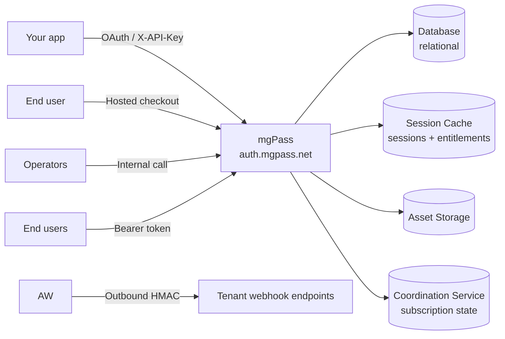

## What mgPass is

mgPass is the identity, loyalty, and recurring-revenue platform behind MG Digital. A single account record can authenticate with OAuth, accumulate reward points, and hold one or more subscriptions — all backed by a single management API and a single per-integration record called an **Application**.

## Architecture

mgPass is built from a core service backed by a durable database, a fast cache layer, asset storage, and a per-subscription coordination service:

```mermaid
graph LR
    Client[Your app] -->|OAuth / X-API-Key| MGP[mgPass<br/>auth.mgpass.net]
    Pay[End user] -->|Hosted checkout| MGP
    Operator[Operators] -->|Internal call| MGP
    Account[End users] -->|Bearer token| MGP
    MGP --> DB[(Database<br/>relational)]
    MGP --> CACHE[(Session Cache<br/>sessions + entitlements)]
    MGP --> ASSETS[(Asset Storage)]
    MGP --> COORD[(Coordination Service<br/>subscription state)]
    AW -->|Outbound HMAC| Webhooks[Tenant webhook endpoints]
```

### Four surfaces

| Service | Domain | Purpose |
|---------|--------|---------|
| **mgPass API** | `auth.mgpass.net` | Core API — OAuth, users, Applications, Subscriptions, Rewards, webhook delivery, SDK bundle, hosted checkout route |
| **Hosted checkout** | `pay.mgpass.net` | Public `/checkout/:sessionId` page rendered by the mgPass service for redirect-style flows |
| **developer console** | `console.mgpass.net` | Self-serve dashboard — register Applications, configure plans, subscriptions, webhooks, OAuth credentials, branding |
| **account portal** | `mgpass.net` | End-user self-service — profile, sessions, subscriptions, notifications, rewards |

### Infrastructure

- **The mgPass service** for compute.
- **A relational database** for durable data (users, applications, plans, subscriptions, ledger).
- **A fast cache layer** for sessions, entitlement caches, and feature flags.
- **Asset storage** for uploaded assets.
- **A coordination service** for the per-subscription state machine that gates renewals.
- **A job queue** for renewal scheduling and webhook delivery retries.

## Core concepts

### Applications (v3 unified model)

Every integration — a web app, a partner storefront, a subscription tenant — is one row in the `applications` table. That row carries the integration's slug, name, branding, and organization. Capabilities are attached as separate rows:

- `application_oauth` — OAuth client (redirect URIs, scopes, token TTLs, refresh rotation, secret hash).
- `application_rewards` — Rewards partner (event types, custom rules, points multiplier, API key hash).
- `application_subscriptions` — Subscription tenant (billing email, JWT entitlement mode, allowed widget origins, API key hash).

A capability is enabled by inserting its row and disabled by deleting it — there is no boolean. The legacy `oauth_clients`, `rewards_partners`, and `subscription_tenants` tables are gone. One `application_id` is the durable foreign key across the database, services, and API JSON.

### Users, roles, scopes

Every person has a user record with profile data and credentials. **Roles** are named collections of **scopes**, and scopes appear in JWT access tokens to gate **API resources** (your protected APIs, e.g. `https://api.yourapp.com`). Roles can be default (auto-assigned), restricted to machine-to-machine clients, or organization-scoped.

### Organizations

Organizations represent tenants — partner companies, enterprise customers, or business units. Members can hold organization-scoped roles separate from their global roles.

### Plans and Subscriptions

A **Plan** is the price + interval + currency + features bundle defined per Application. A **Subscription** binds a user to a plan with a billing cycle, current period, and lifecycle state (trialing, active, past_due, unpaid, cancelled, expired). The Subscriptions Engine maintains state in a per-subscription coordination service, charges via Paystack, and emits webhooks at every transition.

### Checkout sessions

A short-lived record (created via `POST /v1/checkout`) that captures the plan, customer, promo code, mode (`hosted` or `embedded`), and success/cancel URLs. Hosted mode returns a `pay.mgpass.net/checkout/:sessionId` URL; embedded mode is loaded by the `checkout.js` widget in an iframe.

### Sponsored subscriptions

Admin-provisioned subs that skip Paystack entirely — used for comps, internal access, and partnership grants. Idempotent via a partial unique index, excluded from monetary aggregates, and tracked in the same lifecycle as paid subs.

### Notifications inbox

Per-user record of every notification the platform sent (email, SMS, in-app) plus user preferences per category and per surface. The inbox lives in the account portal at `/notifications`.

## The three engines

### Identity & Auth

OAuth 2.0 / OIDC authorization code, PKCE, client credentials, and refresh-token rotation. SMS OTP, social login (Google, Apple, Facebook), MFA (TOTP), SSO, and a One Tap SDK. JWKS, OIDC discovery, FedCM, and a hosted login UI. Configure via the `application_oauth` capability.

### Subscriptions Engine

Plans, hosted and embedded checkout, Paystack card billing (GHS and USD on a merchant-multi-currency Paystack account), promo codes, trials, family / multi-seat plans, sponsored subs, upgrade proration, and a renewal queue driven by per-subscription coordination services. JWT entitlements are signed on demand and cached for sub-millisecond enforcement. Every state transition emits a webhook: `subscription.created`, `.activated`, `.renewed`, `.payment_failed`, `.unpaid`, `.cancelled`, `.expired`, `.trial_ending`, `.plan_changed`. The embed widget (`https://auth.mgpass.net/sdk/checkout.js`) ships with an SRI hash and origin-checks against `application_subscriptions.allowed_widget_origins`.

Annual plans are card-only. Hubtel MoMo repeat payments are deferred — document this capability gap with users on mobile-money-only flows.

### Rewards

A points engine with configurable per-Application rules, awarded against partner-published events (`POST /api/partner/events`). Points accumulate toward tiers, can be redeemed against a catalog, or cashed out to mobile money. Configure via the `application_rewards` capability.

## API authentication

mgPass uses three authentication methods. Pick by who the caller is:

<AccordionGroup>
  <Accordion title="OAuth Bearer access_token — end users">
    Issued by the OAuth flows. Carries user identity and scopes. Use for account self-service endpoints (`/api/account/*`), userinfo, and any user-scoped action your app performs on the user's behalf.
  </Accordion>
  <Accordion title="Admin Bearer token — operators">
    A bearer token issued to admin users via the OAuth flow with the `mgpass:admin` scope. Required for the entire management API: `/api/applications/*`, `/api/users`, `/api/subscriptions/*`, `/api/rewards/*`, audit logs, and so on.
  </Accordion>
  <Accordion title="X-API-Key — tenant / partner servers">
    Static API keys issued per Application capability. Sent in the `X-API-Key` header. Used by tenant-facing v1 endpoints (`/v1/checkout`, `/v1/plans`, `/v1/subscriptions`, `/v1/promo-codes`, `/v1/notifications`) and the rewards partner events endpoint (`/api/partner/events`).
  </Accordion>
</AccordionGroup>

## Conventions

- **Money is in minor units** (pesewas for GHS, cents for USD) everywhere — request bodies, responses, webhooks.
- **Currency** is always `GHS` or `USD` and travels alongside `amount` on every money-bearing field.
- **Audit event types** follow `{entity}.{sub_entity?}.{action}` in snake_case.
- **Secrets:** bcrypt-hashed columns end in `_secret_hash`; raw HMAC values (e.g. webhook signing) live in `*_secret`.

## Base URLs

| Environment | URL |
|-------------|-----|
| Production | `https://auth.mgpass.net` |

## Next steps

<CardGroup cols={2}>
  <Card title="Subscriptions overview" icon="repeat" href="/guides/subscriptions/overview">
    Tour the Subscriptions Engine end-to-end.
  </Card>
  <Card title="Applications model" icon="grid-2" href="/guides/applications">
    Register an Application and enable capabilities.
  </Card>
  <Card title="OAuth flows" icon="key" href="/guides/oauth-flows">
    Wire up sign-in for your client.
  </Card>
  <Card title="API reference" icon="code" href="/api-reference/introduction">
    Endpoint-by-endpoint reference.
  </Card>
</CardGroup>
