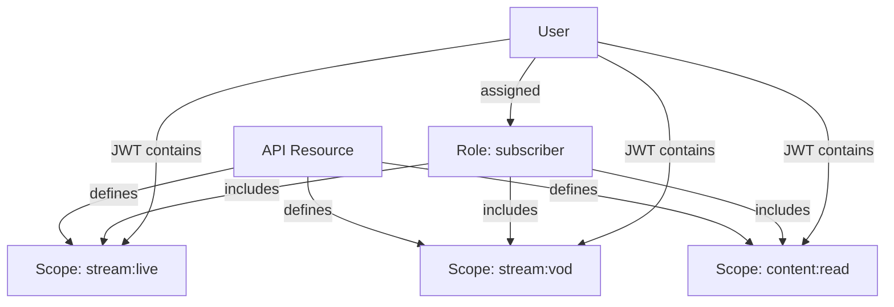

## Overview

mgPass implements role-based access control (RBAC) to manage what users and applications can do. The model has three layers:

1. **API Resources** define protected APIs and their available scopes
2. **Roles** group scopes into named permission sets
3. **Users** are assigned roles, and their access tokens contain the granted scopes



## API Resources

An API resource represents a protected API with a unique indicator (typically a URL).

```bash
curl -X POST https://pass.mediageneral.digital/api/api-resources \
  -H "Authorization: Bearer ADMIN_TOKEN" \
  -H "Content-Type: application/json" \
  -d '{
    "name": "adesa+ Streaming API",
    "indicator": "https://api.adesa.plus",
    "is_default": false
  }'
```

### Add Scopes to a Resource

```bash
curl -X POST https://pass.mediageneral.digital/api/api-resources/res_abc123/scopes \
  -H "Authorization: Bearer ADMIN_TOKEN" \
  -H "Content-Type: application/json" \
  -d '{
    "name": "stream:live",
    "description": "Access live streams"
  }'
```

## Roles

Roles are named collections of scopes from one or more API resources.

### Create a Role

```bash
curl -X POST https://pass.mediageneral.digital/api/roles \
  -H "Authorization: Bearer ADMIN_TOKEN" \
  -H "Content-Type: application/json" \
  -d '{
    "name": "subscriber",
    "description": "adesa+ subscriber with streaming access",
    "is_default": false,
    "type": "user",
    "scope_ids": ["scope_stream_live", "scope_stream_vod", "scope_content_read"]
  }'
```

### Role Properties

| Field | Type | Description |
|-------|------|-------------|
| `name` | string | Unique role name |
| `description` | string | Human-readable description |
| `is_default` | boolean | Auto-assign to new users |
| `type` | string | `user` or `machine_to_machine` |
| `scope_ids` | string[] | Scopes included in this role |

### Default Roles

Roles marked `is_default: true` are automatically assigned to every new user on registration. Use this for baseline permissions that all users should have.

### M2M Roles

Roles with `type: "machine_to_machine"` can only be assigned to M2M applications, not to users. Use these for service-level permissions.

## Assign Roles to Users

```bash
# Assign
curl -X POST https://pass.mediageneral.digital/api/users/usr_abc123/roles \
  -H "Authorization: Bearer ADMIN_TOKEN" \
  -H "Content-Type: application/json" \
  -d '{ "role_id": "role_subscriber" }'

# Remove
curl -X DELETE https://pass.mediageneral.digital/api/users/usr_abc123/roles/role_subscriber \
  -H "Authorization: Bearer ADMIN_TOKEN"
```

## How Scopes Appear in JWTs

When a user authenticates, their access token includes scopes from all assigned roles (filtered to what the application requested):

```json
{
  "sub": "usr_abc123",
  "aud": "https://api.adesa.plus",
  "scope": "stream:live stream:vod content:read",
  "iat": 1711900000,
  "exp": 1711903600
}
```

## Example: adesa+ Subscriber Role

<Steps>
  <Step title="Create the API resource">
    Create a resource for the adesa+ streaming API with indicator `https://api.adesa.plus`.
  </Step>
  <Step title="Define scopes">
    Add scopes: `stream:live`, `stream:vod`, `content:read`, `content:download`.
  </Step>
  <Step title="Create the role">
    Create a "subscriber" role that includes `stream:live`, `stream:vod`, and `content:read`.
  </Step>
  <Step title="Assign to users">
    Assign the subscriber role to users who purchase an adesa+ subscription.
  </Step>
</Steps>

The adesa+ application then checks for the required scope in the access token before granting access to a stream.
