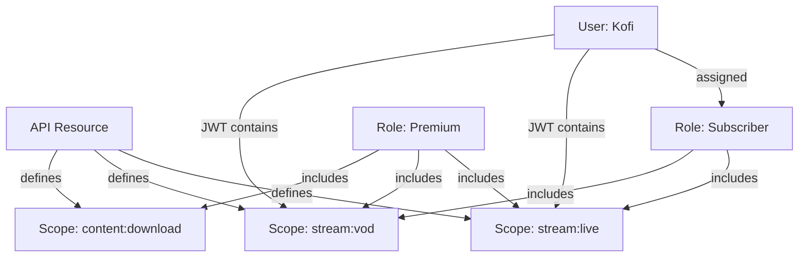

## How RBAC Works in mgPass

mgPass uses a three-layer RBAC model. Understanding these layers is essential for securing your applications:



### Layer 1: API Resources & Scopes

An **API Resource** represents a protected API. **Scopes** define what capabilities that API exposes.

Think of it like this:
- **API Resource** = "adesa+ Streaming API" (the thing being protected)
- **Scopes** = "stream:live", "stream:vod", "content:download" (the permissions within it)

### Layer 2: Roles

A **Role** is a named collection of scopes drawn from one or more API resources. Roles are what you assign to users — not individual scopes.

| Role | Scopes | Who gets it |
|------|--------|------------|
| mgpass:user | profile:read | Everyone (default role) |
| adesa:subscriber | stream:live, stream:vod, profile:read | Paid adesa+ users |
| adesa:premium | stream:live, stream:vod, content:download, profile:read | Premium subscribers |
| mgtix:organizer | events:create, events:read, tickets:manage | Event organizers |
| mgpass:admin | Full admin access | MG Digital staff |

### Layer 3: Role Assignment

Roles are assigned to users. A user can have multiple roles. Assignment happens through:

- **Manual** — an admin assigns via the console or API
- **Automatic** — roles marked `is_default` are assigned on registration
- **Programmatic** — your backend calls the mgPass API when a subscription is purchased

---

## Setting Up RBAC (Admin Console)

### Step 1: Create an API Resource

<Steps>
  <Step title="Navigate to Roles > API Resources">
    In the admin console, go to **Roles** in the sidebar, then click the **API Resources** tab at the top.
  </Step>
  <Step title="Create the resource">
    Fill in:
    - **Name** — human-readable label (e.g., "adesa+ Streaming API")
    - **Identifier** — unique URI used as the `audience` in JWTs (e.g., `https://api.adesa.com.gh`)

    Click **Create**.
  </Step>
  <Step title="Add scopes">
    On the resource row, use the inline form to add scopes one by one:
    - **Name** — the scope identifier (e.g., `stream:live`)
    - **Description** — what this scope allows (e.g., "Access live streams")

    Repeat for each permission your API needs.
  </Step>
</Steps>

**Common scope naming patterns:**
```
resource:action     → stream:live, events:create, tickets:purchase
resource:modifier   → content:premium, support:priority
admin:resource      → admin:users, admin:billing
```

### Step 2: Create Roles

<Steps>
  <Step title="Navigate to Roles">
    Click **Roles** in the sidebar. You'll see existing roles.
  </Step>
  <Step title="Create a new role">
    Click **Create Role**. Fill in:
    - **Name** — unique identifier (e.g., `adesa:subscriber`)
    - **Description** — what this role represents
    - **Type** — `user` for human users, `m2m` for machine-to-machine apps
  </Step>
  <Step title="Assign scopes to the role">
    On the role detail page, use the scope assignment section to add scopes from your API resources. Check the scopes this role should include.
  </Step>
  <Step title="(Optional) Set as default">
    Click **Set as Default** if every new user should get this role on registration. Only use this for baseline roles like `mgpass:user`.
  </Step>
</Steps>

### Step 3: Assign Roles to Users

<Steps>
  <Step title="Find the user">
    Go to **Users**, search for the user, click their name to open the detail page.
  </Step>
  <Step title="Assign a role">
    In the **Roles & Permissions** section, select a role from the dropdown and click **Assign**.
  </Step>
  <Step title="Verify">
    The role appears in the user's role list. Their next access token will include the scopes from this role.
  </Step>
</Steps>

---

## Setting Up RBAC (API)

### Create an API Resource

```bash
curl -X POST https://pass.mediageneral.digital/api/api-resources \
  -H "Authorization: Bearer ADMIN_TOKEN" \
  -H "Content-Type: application/json" \
  -d '{
    "name": "adesa+ Streaming API",
    "identifier": "https://api.adesa.com.gh"
  }'
```

### Add Scopes

```bash
curl -X POST https://pass.mediageneral.digital/api/api-resources/res_abc123/scopes \
  -H "Authorization: Bearer ADMIN_TOKEN" \
  -H "Content-Type: application/json" \
  -d '{
    "name": "stream:live",
    "description": "Access live streams"
  }'
```

### Create a Role

```bash
curl -X POST https://pass.mediageneral.digital/api/roles \
  -H "Authorization: Bearer ADMIN_TOKEN" \
  -H "Content-Type: application/json" \
  -d '{
    "name": "adesa:subscriber",
    "description": "adesa+ subscriber with streaming access",
    "type": "user",
    "is_default": false
  }'
```

### Assign Scopes to a Role

```bash
curl -X POST https://pass.mediageneral.digital/api/roles/role_abc123/scopes \
  -H "Authorization: Bearer ADMIN_TOKEN" \
  -H "Content-Type: application/json" \
  -d '{ "scope_id": "scope_stream_live" }'
```

### Assign a Role to a User

```bash
curl -X POST https://pass.mediageneral.digital/api/users/usr_abc123/roles \
  -H "Authorization: Bearer ADMIN_TOKEN" \
  -H "Content-Type: application/json" \
  -d '{ "role_id": "role_subscriber" }'
```

### Remove a Role

```bash
curl -X DELETE https://pass.mediageneral.digital/api/users/usr_abc123/roles/role_subscriber \
  -H "Authorization: Bearer ADMIN_TOKEN"
```

---

## How Scopes Appear in JWTs

When a user authenticates, mgPass builds their access token by:

1. Collecting all roles assigned to the user
2. Gathering all scopes from those roles
3. Filtering to only scopes the **application** is allowed to request
4. Including the final scope list in the JWT

```json
{
  "sub": "usr_abc123",
  "aud": "https://api.adesa.com.gh",
  "scope": "stream:live stream:vod profile:read",
  "roles": ["adesa:subscriber"],
  "iss": "https://pass.mediageneral.digital",
  "iat": 1711900000,
  "exp": 1711903600
}
```

Your API validates the token and checks the `scope` claim:

```javascript
// In your adesa+ API middleware
const scopes = token.scope.split(' ');
if (!scopes.includes('stream:live')) {
  return res.status(403).json({ error: 'insufficient_scope' });
}
```

---

## Default Roles

Roles with `is_default: true` are automatically assigned to every new user on registration. Use this for:

- `mgpass:user` — basic profile access everyone needs
- A "free tier" role with limited permissions

<Note>
Default roles only apply to new registrations. Existing users without the role are not affected. To backfill, assign the role via the API or admin console.
</Note>

---

## M2M Roles

Machine-to-machine applications (backend services) get roles too, but their roles have `type: "m2m"`. These roles:

- Can only be assigned to M2M applications, not to users
- Define what APIs the service can call
- Scopes appear in the access token from the Client Credentials grant

**Example:** mgRewards backend needs to call the mgPass Management API to look up user profiles:

1. Create an M2M role `rewards:service` with scope `users:read`
2. Assign it to the mgRewards M2M application
3. mgRewards authenticates with Client Credentials and gets a token with `users:read`

---

## Real-World Example: adesa+ Integration

Here's how the full RBAC setup works for adesa+:

<Steps>
  <Step title="Create API Resource">
    Name: "adesa+ API", Identifier: `https://api.adesa.com.gh`
    Scopes: `stream:live`, `stream:vod`, `content:download`, `profile:read`
  </Step>
  <Step title="Create Roles">
    - **adesa:free** — `stream:live` (limited), `profile:read`
    - **adesa:subscriber** — `stream:live`, `stream:vod`, `profile:read`
    - **adesa:premium** — all scopes including `content:download`
  </Step>
  <Step title="Register adesa+ as an Application">
    Type: Native (mobile) / SPA (web). Allowed scopes: all adesa+ scopes.
  </Step>
  <Step title="Assign Roles on Subscription">
    When a user purchases a subscription through your billing system, call the mgPass API:
    ```bash
    POST /api/users/{user_id}/roles
    { "role_id": "role_adesa_subscriber" }
    ```
  </Step>
  <Step title="Check Scopes in Your API">
    The adesa+ backend validates the JWT and checks for required scopes before granting access to streams.
  </Step>
</Steps>

---

## Best Practices

<CardGroup cols={2}>
  <Card title="Principle of Least Privilege" icon="shield-check">
    Give roles only the scopes they need. A subscriber doesn't need `content:download` — that's for premium.
  </Card>
  <Card title="Use Meaningful Names" icon="tag">
    `adesa:subscriber` is better than `role_1`. Names appear in admin UI and audit logs.
  </Card>
  <Card title="One Default Role" icon="user-check">
    Keep one default role for baseline access. Don't auto-assign premium permissions.
  </Card>
  <Card title="Scope at the API Level" icon="code">
    Check scopes in your API, not in the frontend. The frontend can hide UI elements, but the API enforces access.
  </Card>
</CardGroup>
