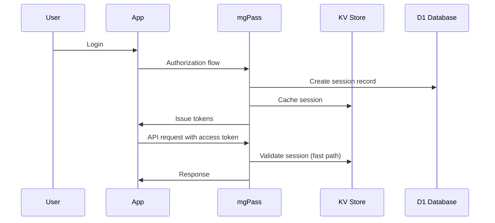

## Overview

When a user authenticates, mgPass creates a session and issues tokens. Sessions track the authentication state, while tokens provide access to protected resources.

## Session Lifecycle



### Dual-Write Storage

Sessions are stored in both KV and D1 for performance and durability:

- **KV** — Primary lookup for token validation (fast, eventually consistent)
- **D1** — Durable record for session management and audit (strongly consistent)

## Token Types

| Token | Format | Lifetime | Purpose |
|-------|--------|----------|---------|
| **Access Token** | JWT (RS256) | 1 hour (configurable) | Authorize API requests |
| **Refresh Token** | Opaque string | 30 days (configurable) | Obtain new access tokens |
| **ID Token** | JWT (RS256) | 1 hour | User identity claims (OIDC) |

### Access Token Claims

```json
{
  "iss": "https://pass.mediageneral.digital",
  "sub": "usr_abc123",
  "aud": "app_xyz789",
  "scope": "openid profile email stream:live",
  "iat": 1711900000,
  "exp": 1711903600,
  "jti": "tok_unique_id"
}
```

### ID Token Claims

```json
{
  "iss": "https://pass.mediageneral.digital",
  "sub": "usr_abc123",
  "aud": "app_xyz789",
  "name": "Kwame Asante",
  "email": "kwame@example.com",
  "email_verified": true,
  "picture": "https://r2.mgdm.dev/avatars/usr_abc123.jpg",
  "iat": 1711900000,
  "exp": 1711903600
}
```

## Token Lifetimes

Default lifetimes can be overridden per application:

| Token | Default | Configurable Range |
|-------|---------|--------------------|
| Access token | 3600s (1 hour) | 300s - 86400s |
| Refresh token | 2592000s (30 days) | 86400s - 7776000s |
| ID token | 3600s (1 hour) | Matches access token |

## Refresh Token Rotation

mgPass implements refresh token rotation for security:

1. Client sends the refresh token to `/api/token` with `grant_type=refresh_token`
2. mgPass validates the refresh token and issues a new token pair
3. The old refresh token is invalidated

<Warning>
**Replay detection:** If a previously-used refresh token is submitted, mgPass revokes the entire token family (all tokens from that session). This protects against token theft.
</Warning>

## Session Revocation

### User Self-Service

Users can view and revoke their own sessions from the account portal:

```bash
# List own sessions
curl https://pass.mediageneral.digital/api/account/sessions \
  -H "Authorization: Bearer USER_TOKEN"

# Revoke a session
curl -X POST https://pass.mediageneral.digital/api/account/sessions/sess_abc123/revoke \
  -H "Authorization: Bearer USER_TOKEN"
```

### Admin Revocation

Admins can revoke all sessions for a user:

```bash
curl -X POST https://pass.mediageneral.digital/api/users/usr_abc123/sessions/revoke-all \
  -H "Authorization: Bearer ADMIN_TOKEN"
```

## Device Information

Sessions track device metadata for display in the account portal:

```json
{
  "session_id": "sess_abc123",
  "user_agent": "Mozilla/5.0 (iPhone; CPU iPhone OS 17_0 like Mac OS X)",
  "ip_address": "41.215.x.x",
  "device_type": "mobile",
  "last_active_at": 1711900000,
  "created_at": 1711890000
}
```
