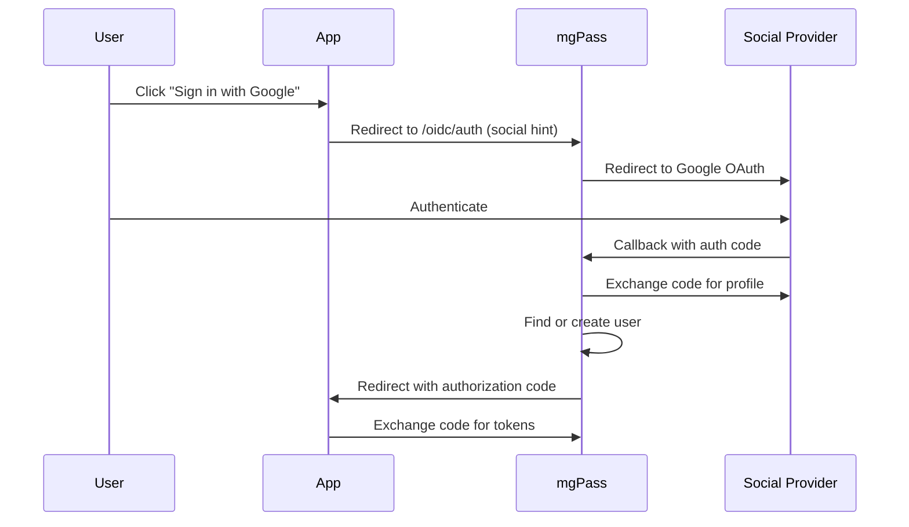

## Overview

mgPass supports social login via connectors for Google, Apple, and Facebook. Users can sign in with their existing social accounts, which are linked to their mgPass user profile.

## How Social Login Works



## Google Connector

### Configuration

| Field | Description |
|-------|-------------|
| `client_id` | Google OAuth 2.0 client ID |
| `client_secret` | Google OAuth 2.0 client secret |
| `hosted_domains` | Restrict to specific Google Workspace domains (optional) |

### Setup

1. Go to the [Google Cloud Console](https://console.cloud.google.com/apis/credentials)
2. Create an OAuth 2.0 client ID (Web application type)
3. Add `https://auth.mgpass.net/callback/google` as an authorized redirect URI
4. Configure the connector in the mgPass admin console with the client ID and secret

<Note>
Set `hosted_domains` to restrict sign-in to specific Google Workspace domains (e.g., `["mediageneral.com"]`). Leave empty to allow any Google account.
</Note>

## Apple Connector

### Configuration

| Field | Description |
|-------|-------------|
| `team_id` | Apple Developer Team ID |
| `key_id` | Sign in with Apple key ID |
| `private_key` | The `.p8` private key contents |
| `client_id` | Service ID identifier |

### Setup

1. In Apple Developer Portal, enable "Sign in with Apple" for your App ID
2. Create a Service ID and configure the web authentication settings
3. Add `https://auth.mgpass.net/callback/apple` as a return URL
4. Generate a private key for Sign in with Apple
5. Configure the connector in the mgPass admin console

<Warning>
Apple only sends the user's name on the first authentication. mgPass stores it on initial link, but if missed, the name field will be empty.
</Warning>

## Facebook Connector

### Configuration

| Field | Description |
|-------|-------------|
| `app_id` | Facebook App ID |
| `app_secret` | Facebook App Secret |

### Setup

1. Create a Facebook App at [developers.facebook.com](https://developers.facebook.com)
2. Add Facebook Login product
3. Add `https://auth.mgpass.net/callback/facebook` as a valid OAuth redirect URI
4. Configure the connector in the mgPass admin console

## Linking and Unlinking

### Automatic Linking

When a user signs in with a social provider and their social email matches an existing mgPass account, the social identity is automatically linked to the existing account.

### Viewing Linked Accounts

```bash
curl https://auth.mgpass.net/api/users/usr_abc123/identities \
  -H "Authorization: Bearer ADMIN_TOKEN"
```

**Response:**

```json
[
  {
    "provider": "google",
    "provider_user_id": "118234567890",
    "email": "kwame@gmail.com",
    "name": "Kwame Asante",
    "linked_at": 1711900000
  }
]
```

### Unlinking

Users can unlink social accounts from their profile in the account portal, provided they have at least one other authentication method (email/password or another social account).
