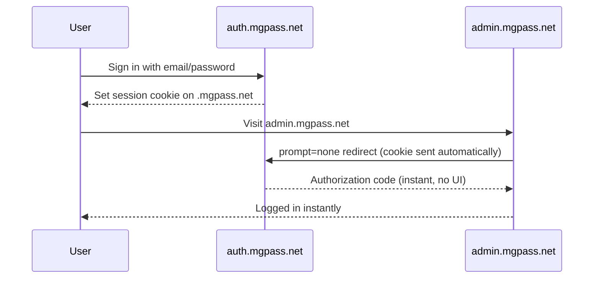
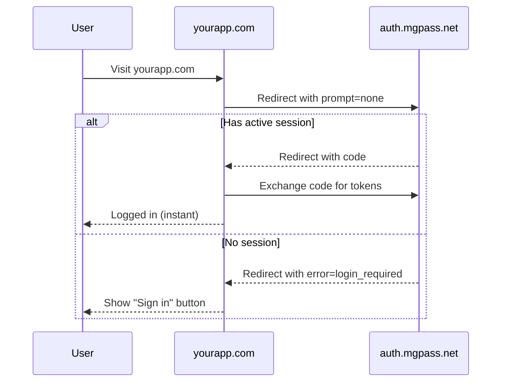
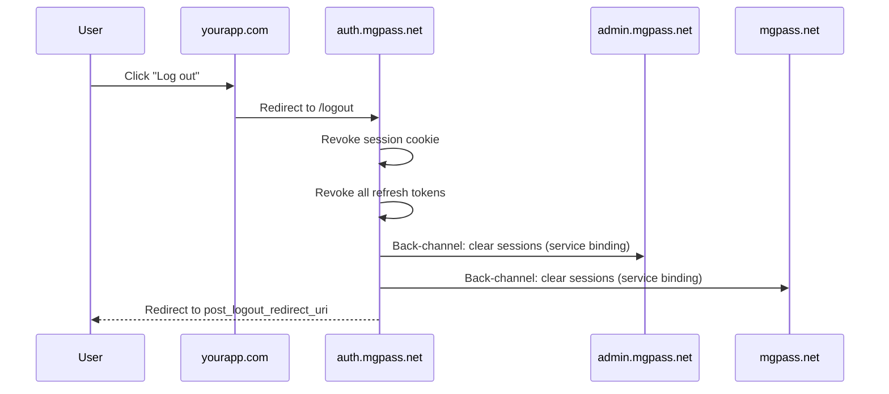

## Overview

mgPass provides Single Sign-On (SSO) so users authenticate once and are automatically recognized across all connected applications. Whether a user signs in on one application and then visits another, or logs into the admin console after authenticating on the account portal, mgPass handles the session sharing transparently.

There are two SSO modes depending on whether the applications share a domain.

## Same-Domain SSO

All mgPass properties share the `.mgpass.net` parent domain:

- `auth.mgpass.net` -- authentication server
- `admin.mgpass.net` -- admin console
- `mgpass.net` -- user account portal

When a user authenticates on any of these, mgPass sets a session cookie on the parent domain (`.mgpass.net`). Because all properties share this domain, the cookie is automatically sent with every request.



<Note>
Same-domain SSO is completely transparent to the user. Visiting `admin.mgpass.net` while logged into `auth.mgpass.net` triggers a `prompt=none` redirect behind the scenes -- the user never sees a login screen.
</Note>

## Cross-Domain SSO

Applications on different domains (your apps, partner sites) cannot share cookies with `.mgpass.net`. Instead, they use the OIDC `prompt=none` redirect pattern to check for an active session.

### How It Works

<Steps>
  <Step title="Check for existing session">
    Your application redirects the user to mgPass with `prompt=none`. This tells mgPass to skip the login UI entirely:

    ```
    GET https://auth.mgpass.net/oidc/auth?
      prompt=none
      &client_id=YOUR_CLIENT_ID
      &redirect_uri=https://yourapp.com/callback
      &response_type=code
      &scope=openid+profile+email
      &state=RANDOM_STATE
    ```
  </Step>

  <Step title="mgPass checks the session">
    mgPass checks if the user has an active session cookie. Three outcomes are possible:

    | Outcome | Response | Meaning |
    |---------|----------|---------|
    | Active session, app authorized | Redirect with `?code=AUTH_CODE&state=...` | Instant SSO login |
    | No session | Redirect with `?error=login_required` | User must sign in |
    | Session exists, first-time app | Redirect with `?error=consent_required` | Consent screen needed |
  </Step>

  <Step title="Handle the response">
    Your callback page inspects the redirect parameters and acts accordingly:

    - **Got a code?** Exchange it for tokens -- user is logged in.
    - **Got `login_required`?** Show a "Sign in with mgPass" button.
    - **Got `consent_required`?** Redirect again without `prompt=none` to show the consent screen.
  </Step>
</Steps>

### JavaScript Implementation

<CodeGroup>
```javascript Browser (Vanilla JS)
// 1. Build the silent auth URL
function buildSilentAuthURL() {
  const params = new URLSearchParams({
    prompt: "none",
    client_id: "YOUR_CLIENT_ID",
    redirect_uri: window.location.origin + "/callback",
    response_type: "code",
    scope: "openid profile email",
    state: crypto.randomUUID(),
  });
  return `https://auth.mgpass.net/oidc/auth?${params}`;
}

// 2. On page load, try silent SSO
async function trySilentSSO() {
  // Redirect to mgPass with prompt=none
  window.location.href = buildSilentAuthURL();
}

// 3. Handle the callback
function handleCallback() {
  const params = new URLSearchParams(window.location.search);

  if (params.has("code")) {
    // SSO success -- exchange code for tokens
    exchangeCodeForTokens(params.get("code"));
  } else if (params.get("error") === "login_required") {
    // No active session -- show login button
    showLoginButton();
  } else if (params.get("error") === "consent_required") {
    // First-time app -- redirect without prompt=none
    redirectToFullAuth();
  }
}

function showLoginButton() {
  const section = document.getElementById("login-section");
  const button = document.createElement("button");
  button.textContent = "Sign in with mgPass";
  button.addEventListener("click", redirectToFullAuth);
  section.appendChild(button);
}

function redirectToFullAuth() {
  const params = new URLSearchParams({
    client_id: "YOUR_CLIENT_ID",
    redirect_uri: window.location.origin + "/callback",
    response_type: "code",
    scope: "openid profile email",
    state: crypto.randomUUID(),
  });
  window.location.href =
    `https://auth.mgpass.net/oidc/auth?${params}`;
}
```

```javascript React / Next.js
import { useEffect, useState } from "react";

const MGPASS_AUTH = "https://auth.mgpass.net/oidc/auth";
const CLIENT_ID = process.env.NEXT_PUBLIC_MGPASS_CLIENT_ID;
const REDIRECT_URI = process.env.NEXT_PUBLIC_REDIRECT_URI;

export function useSSO() {
  const [status, setStatus] = useState("checking");
  // status: "checking" | "authenticated" | "unauthenticated"

  useEffect(() => {
    const params = new URLSearchParams(window.location.search);

    if (params.has("code")) {
      // Exchange code for tokens on the server side
      fetch("/api/auth/callback?code=" + params.get("code"))
        .then((res) => res.json())
        .then(() => setStatus("authenticated"));
    } else if (params.get("error") === "login_required") {
      setStatus("unauthenticated");
    } else if (params.get("error") === "consent_required") {
      // Redirect to full auth (shows consent screen)
      redirectToAuth();
    } else {
      // Try silent SSO check
      trySilentSSO();
    }
  }, []);

  function trySilentSSO() {
    const params = new URLSearchParams({
      prompt: "none",
      client_id: CLIENT_ID,
      redirect_uri: REDIRECT_URI,
      response_type: "code",
      scope: "openid profile email",
      state: crypto.randomUUID(),
    });
    window.location.href = `${MGPASS_AUTH}?${params}`;
  }

  function redirectToAuth() {
    const params = new URLSearchParams({
      client_id: CLIENT_ID,
      redirect_uri: REDIRECT_URI,
      response_type: "code",
      scope: "openid profile email",
      state: crypto.randomUUID(),
    });
    window.location.href = `${MGPASS_AUTH}?${params}`;
  }

  return { status, redirectToAuth };
}
```
</CodeGroup>



## Global Logout

When a user logs out from any mgPass surface, all sessions are destroyed everywhere.

### How It Works

1. **User triggers logout** from any connected application (admin console, account portal, or a partner app)
2. **mgPass revokes all sessions** -- the session cookie, all refresh tokens, and all active sessions are destroyed
3. **Back-channel notifications** -- mgPass notifies the admin and account workers via Cloudflare service bindings to clear their local sessions
4. **User is redirected** to the post-logout URL

### Implementing Logout

Redirect the user to the mgPass logout endpoint:

```
GET https://auth.mgpass.net/logout?
  id_token_hint=USER_ID_TOKEN
  &post_logout_redirect_uri=https://yourapp.com
```

| Parameter | Required | Description |
|-----------|----------|-------------|
| `id_token_hint` | Recommended | The user's ID token -- helps mgPass identify the session without cookies |
| `post_logout_redirect_uri` | Optional | Where to redirect after logout. Must be registered in your app's `post_logout_uris` |

<CodeGroup>
```javascript JavaScript
function logout(idToken) {
  const params = new URLSearchParams({
    id_token_hint: idToken,
    post_logout_redirect_uri: window.location.origin,
  });
  window.location.href =
    `https://auth.mgpass.net/logout?${params}`;
}
```

```python Python
from urllib.parse import urlencode

def get_logout_url(id_token: str, redirect_uri: str) -> str:
    params = urlencode({
        "id_token_hint": id_token,
        "post_logout_redirect_uri": redirect_uri,
    })
    return f"https://auth.mgpass.net/logout?{params}"
```

```bash cURL
# RP-Initiated Logout (browser redirect, not a REST call)
# Redirect the user's browser to:
https://auth.mgpass.net/logout?\
  id_token_hint=eyJhbGciOiJSUzI1NiIs...&\
  post_logout_redirect_uri=https://yourapp.com
```
</CodeGroup>

<Warning>
After global logout, the user must re-authenticate on every application. There is no way to log out of a single app while remaining logged in elsewhere -- this is by design for security.
</Warning>



## Session Lifetime

mgPass sessions use a **30-day sliding window** by default:

| Setting | Value |
|---------|-------|
| Default session duration | 30 days |
| Sliding window | Every SSO use extends the session by 30 days |
| "Remember me" checked | 30-day persistent cookie (survives browser restart) |
| "Remember me" unchecked | Session cookie (cleared when browser closes) |

### Remember Me

The mgPass login form includes a "Remember me for 30 days" checkbox:

- **Checked (default):** mgPass sets a persistent cookie with a 30-day expiry. The user stays logged in across browser restarts.
- **Unchecked:** mgPass sets a session cookie. Closing the browser ends the session.

<Note>
Every time a user's session is used for SSO (visiting any connected application), the 30-day window resets. Active users effectively never need to re-authenticate.
</Note>

## Best Practices

<AccordionGroup>
  <Accordion title="Always try silent SSO first">
    On your application's landing page, redirect to mgPass with `prompt=none` before showing any login UI. This makes the experience seamless for users who are already signed in.
  </Accordion>

  <Accordion title="Handle all three callback states">
    Your callback handler must handle `code` (success), `error=login_required` (no session), and `error=consent_required` (first-time app). Missing any of these causes a broken experience.
  </Accordion>

  <Accordion title="Store the ID token for logout">
    Save the `id_token` from the token exchange response. You need it for the `id_token_hint` parameter during logout.
  </Accordion>

  <Accordion title="Register post-logout URIs">
    Make sure your application's `post_logout_redirect_uris` are configured in the mgPass admin console. Without this, the user sees a generic "logged out" page instead of being redirected back to your app.
  </Accordion>
</AccordionGroup>

## Next Steps

- [Token Refresh](/guides/token-refresh) -- keep users authenticated with automatic token renewal
- [OAuth Flows](/guides/oauth-flows) -- full details on the authorization code flow
- [Applications](/guides/applications) -- register your app to use SSO
