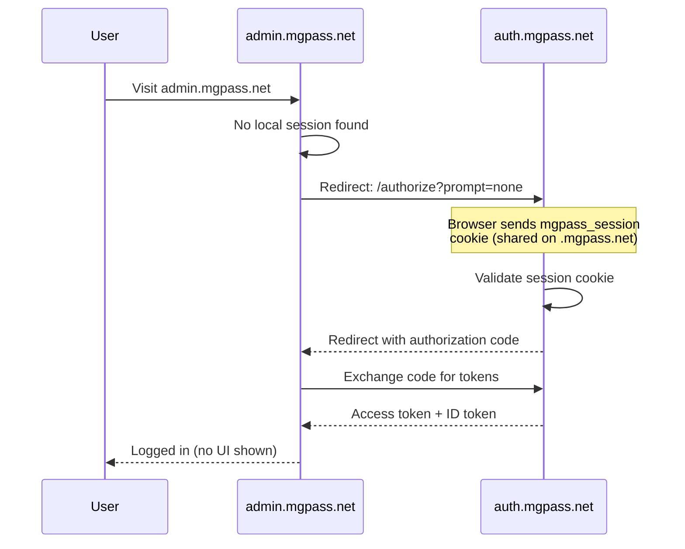
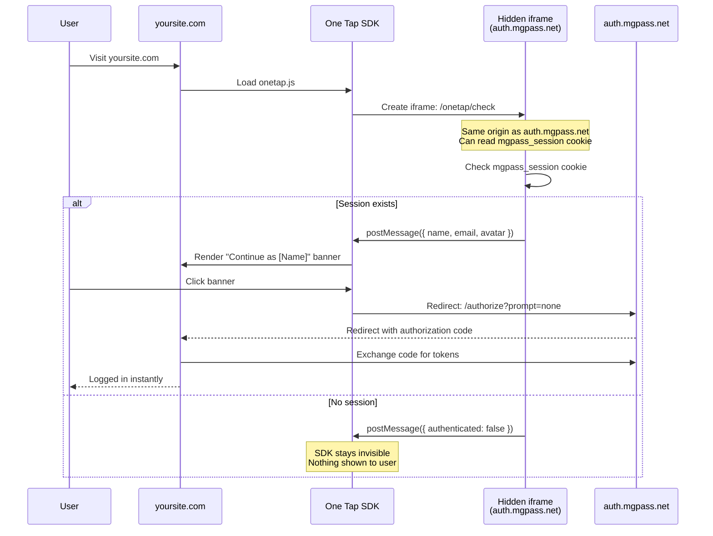
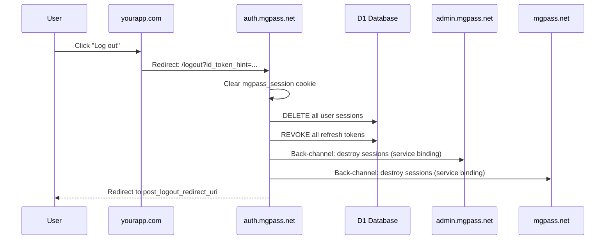

## Overview

mgPass provides Single Sign-On (SSO) so users authenticate once and are automatically recognized across all connected applications. There are two SSO mechanisms depending on whether the application shares the `.mgpass.net` domain.

| Mechanism | When to use | How it works |
|-----------|-------------|--------------|
| Same-domain SSO | Apps on `*.mgpass.net` | Shared session cookie on `.mgpass.net` |
| Cross-domain SSO | Partner sites on other domains | One Tap SDK with hidden iframe |

---

## Same-Domain SSO

All mgPass properties share the `.mgpass.net` parent domain:

- `auth.mgpass.net` -- authentication server
- `admin.mgpass.net` -- admin console
- `mgpass.net` -- user account portal

When a user authenticates, the auth-worker sets a `mgpass_session` cookie on the `.mgpass.net` domain. Because all mgPass properties are subdomains, the cookie is sent with every request automatically.

### How It Works

<Steps>
  <Step title="User signs in">
    The user authenticates on any mgPass surface (e.g. the account portal at `mgpass.net`). The auth-worker sets the `mgpass_session` cookie on `.mgpass.net`.
  </Step>

  <Step title="User visits another mgPass property">
    The user navigates to `admin.mgpass.net`. The session guard detects no local session.
  </Step>

  <Step title="Silent authorization">
    The session guard auto-redirects to `auth.mgpass.net/authorize?prompt=none`. Because the browser sends the shared `.mgpass.net` cookie, the auth-worker finds the active session.
  </Step>

  <Step title="Code issued silently">
    The auth-worker issues an authorization code and redirects back to `admin.mgpass.net`. No login UI is shown.
  </Step>

  <Step title="Token exchange">
    The admin app exchanges the authorization code for tokens. The user is logged in instantly.
  </Step>
</Steps>



<Note>
Same-domain SSO is completely transparent to the user. The entire redirect chain happens in milliseconds and no login screen is ever displayed.
</Note>

### Session Cookie Details

| Property | Value |
|----------|-------|
| Cookie name | `mgpass_session` |
| Domain | `.mgpass.net` |
| Lifetime | 30 days (sliding window) |
| HttpOnly | Yes |
| Secure | Yes |
| SameSite | Lax |

Every time the session is used for SSO (visiting any mgPass property), the 30-day expiry resets. Active users effectively never need to re-authenticate.

---

## Cross-Domain SSO

Applications on different domains (your apps, partner sites) cannot share cookies with `.mgpass.net`. For these, mgPass provides the **One Tap SDK** -- a lightweight JavaScript SDK that checks for an active mgPass session using a hidden iframe.

### How It Works

<Steps>
  <Step title="Embed the SDK">
    The partner site includes the One Tap SDK script tag. The SDK creates a hidden iframe pointing to `auth.mgpass.net/onetap/check`.
  </Step>

  <Step title="Iframe checks session">
    The iframe is on the `auth.mgpass.net` origin, so it CAN read the `mgpass_session` cookie. If a valid session exists, the iframe posts the user's basic profile info (name, email, avatar) back to the parent page via `postMessage`.
  </Step>

  <Step title="Banner displayed">
    The SDK renders a floating "Continue as [Name]" banner in the bottom-right corner of the page. If no session exists, the SDK is completely invisible.
  </Step>

  <Step title="User clicks the banner">
    Clicking the banner starts an OAuth authorization flow with `prompt=none`. Because the session exists, the auth-worker issues an authorization code instantly.
  </Step>

  <Step title="Redirect and token exchange">
    The user is redirected to the partner's `redirect_uri` with an authorization code. The partner exchanges the code for tokens and the user is logged in.
  </Step>
</Steps>



<Note>
The One Tap SDK never exposes tokens, session IDs, or any sensitive data to the partner site. Only basic profile information (name, email, avatar) is shared via `postMessage` to render the banner.
</Note>

For full integration instructions, see the [One Tap SDK Guide](/guides/onetap-sdk).

---

## Global Logout

When a user logs out from **any** mgPass surface, all sessions are destroyed everywhere. This is a security guarantee -- there is no way to log out of a single app while remaining logged in elsewhere.

### What Happens

<Steps>
  <Step title="User triggers logout">
    The user clicks "Log out" on any connected application (admin console, account portal, or a partner app).
  </Step>

  <Step title="Redirect to auth-worker">
    The application redirects to `auth.mgpass.net/logout` with an `id_token_hint` parameter.
  </Step>

  <Step title="Session cookie cleared">
    The auth-worker clears the shared `mgpass_session` cookie on `.mgpass.net`.
  </Step>

  <Step title="All sessions revoked">
    All active sessions for the user are revoked in the D1 database.
  </Step>

  <Step title="All refresh tokens revoked">
    Every refresh token issued to the user is invalidated.
  </Step>

  <Step title="Back-channel logout">
    The auth-worker calls the admin and account workers via Cloudflare service bindings to destroy their local sessions immediately.
  </Step>

  <Step title="User redirected">
    The user is redirected to the `post_logout_redirect_uri`.
  </Step>
</Steps>



### Implementing Logout

Redirect the user to the mgPass logout endpoint:

```
GET https://auth.mgpass.net/logout?
  id_token_hint=USER_ID_TOKEN
  &post_logout_redirect_uri=https://yourapp.com
```

| Parameter | Required | Description |
|-----------|----------|-------------|
| `id_token_hint` | Recommended | The user's ID token. Helps mgPass identify the session without relying on cookies. Expired tokens are accepted (per OIDC spec). |
| `post_logout_redirect_uri` | Optional | Where to redirect after logout. Must be registered in your application's `post_logout_uris`. |

<CodeGroup>
```javascript JavaScript
function logout(idToken) {
  const params = new URLSearchParams({
    id_token_hint: idToken,
    post_logout_redirect_uri: window.location.origin,
  });
  window.location.href =
    `https://auth.mgpass.net/logout?${params}`;
}
```

```python Python
from urllib.parse import urlencode

def get_logout_url(id_token: str, redirect_uri: str) -> str:
    params = urlencode({
        "id_token_hint": id_token,
        "post_logout_redirect_uri": redirect_uri,
    })
    return f"https://auth.mgpass.net/logout?{params}"
```
</CodeGroup>

<Warning>
After global logout, the user must re-authenticate on every application. This is by design for security -- a single logout action provides complete session termination across all connected properties.
</Warning>

---

## Session Lifetime

mgPass sessions use a **30-day sliding window**:

| Setting | Value |
|---------|-------|
| Default session duration | 30 days |
| Sliding window | Every SSO use (silent auth, token refresh) extends the session by 30 days |
| "Remember me" checked | Persistent cookie with 30-day expiry (survives browser restart) |
| "Remember me" unchecked | Session cookie (cleared when browser closes) |

The mgPass login form includes a "Remember me for 30 days" checkbox:

- **Checked (default):** Sets a persistent cookie. The user stays logged in across browser restarts and the 30-day window resets on every use.
- **Unchecked:** Sets a session cookie. Closing the browser ends the session regardless of the 30-day window.

<Note>
Active users who interact with any mgPass-connected application at least once every 30 days will never need to re-authenticate.
</Note>

---

## Best Practices

<AccordionGroup>
  <Accordion title="Use the One Tap SDK for cross-domain SSO">
    Instead of manually implementing `prompt=none` redirects for cross-domain SSO, use the One Tap SDK. It handles the iframe session check, user prompt, and OAuth redirect automatically with a single script tag.
  </Accordion>

  <Accordion title="Handle all callback states">
    Your OAuth callback handler must handle three outcomes: `code` (success), `error=login_required` (no session), and `error=consent_required` (first-time app). Missing any of these causes a broken experience.
  </Accordion>

  <Accordion title="Store the ID token for logout">
    Save the `id_token` from the token exchange response. You need it for the `id_token_hint` parameter during logout. Expired tokens are accepted, so you do not need to keep a fresh one.
  </Accordion>

  <Accordion title="Register post-logout URIs">
    Configure your application's `post_logout_redirect_uris` in the mgPass admin console. Without this, the user sees a generic "logged out" page instead of being redirected back to your app.
  </Accordion>
</AccordionGroup>

## Next Steps

- [One Tap SDK](/guides/onetap-sdk) -- integrate cross-domain SSO with a single script tag
- [Token Refresh](/guides/token-refresh) -- keep users authenticated with automatic token renewal
- [OAuth Flows](/guides/oauth-flows) -- full details on the authorization code flow
- [Applications](/guides/applications) -- register your app to use SSO
