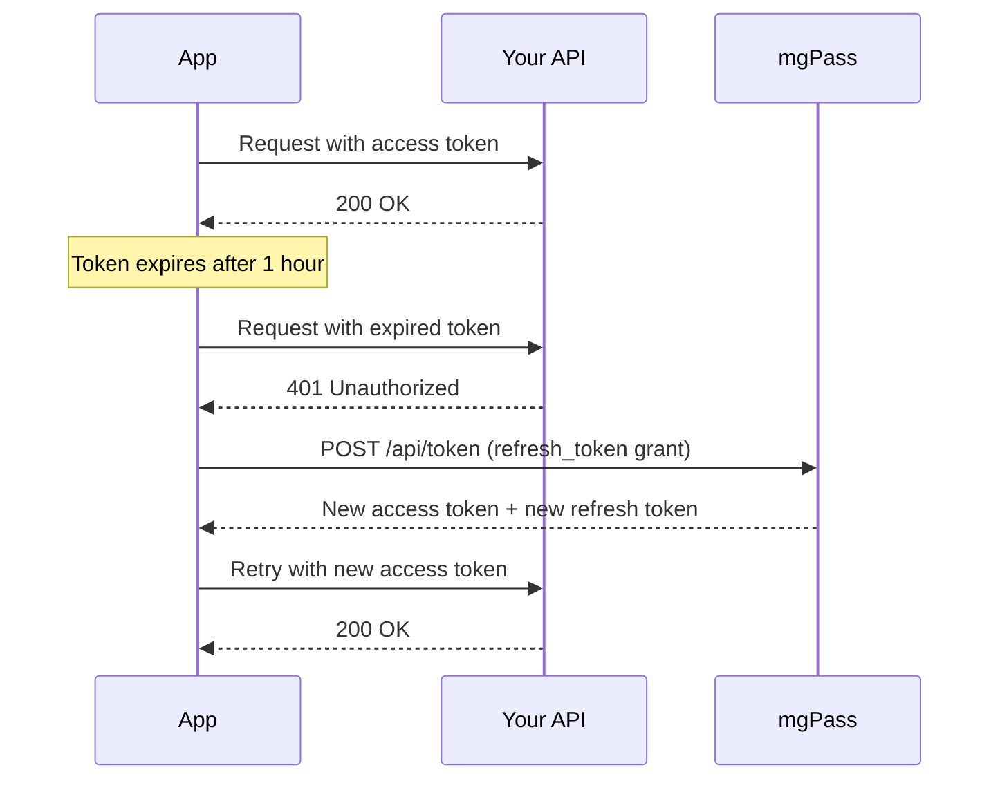
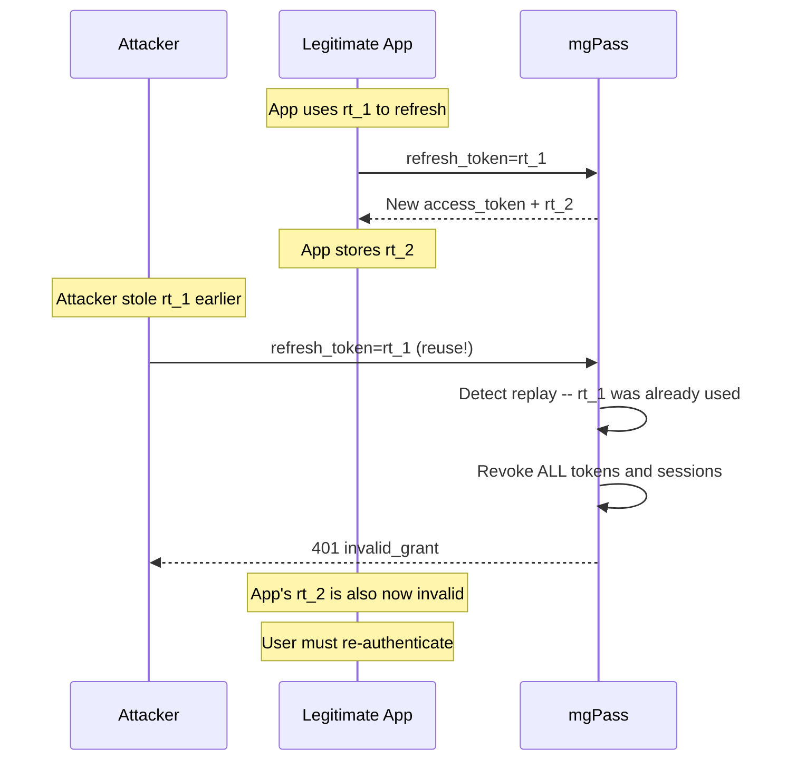
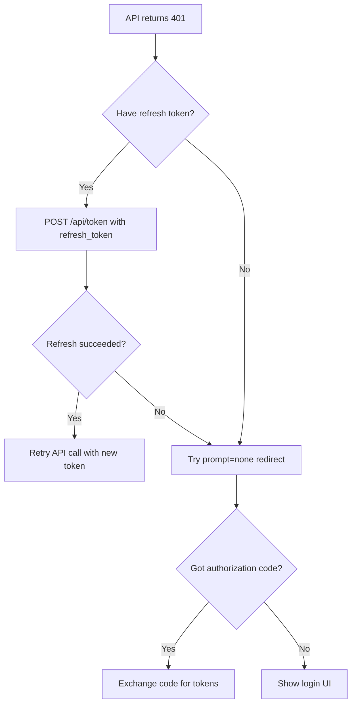
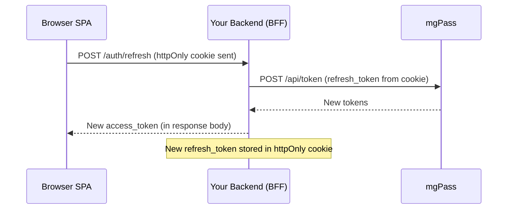

## Token Lifecycle

mgPass issues three types of tokens during authentication:

| Token | Purpose | Default Lifetime | Configurable |
|-------|---------|-----------------|--------------|
| Access Token | Authorize API requests | 1 hour | Per-app (`access_token_ttl`) |
| Refresh Token | Obtain new access tokens | 30 days | Per-app (`refresh_token_ttl`) |
| ID Token | Identity claims (name, email, etc.) | 1 hour | Same as access token |

Access tokens are short-lived by design. When one expires, your application uses the refresh token to get a new pair without requiring the user to sign in again.



## Proactive Token Refresh

Do not wait for a 401 error to refresh tokens. Instead, schedule a refresh at 80% of the token's lifetime:

<CodeGroup>
```javascript JavaScript
class TokenManager {
  constructor(clientId, clientSecret) {
    this.clientId = clientId;
    this.clientSecret = clientSecret;
    this.refreshTimer = null;
  }

  setTokens({ access_token, refresh_token, expires_in }) {
    this.accessToken = access_token;
    this.refreshToken = refresh_token;

    // Schedule refresh at 80% of TTL
    const refreshInMs = expires_in * 0.8 * 1000;
    clearTimeout(this.refreshTimer);
    this.refreshTimer = setTimeout(
      () => this.refresh(),
      refreshInMs
    );
  }

  async refresh() {
    try {
      const response = await fetch(
        "https://pass.mediageneral.digital/api/token",
        {
          method: "POST",
          headers: {
            "Content-Type": "application/x-www-form-urlencoded",
          },
          body: new URLSearchParams({
            grant_type: "refresh_token",
            refresh_token: this.refreshToken,
            client_id: this.clientId,
            client_secret: this.clientSecret,
          }),
        }
      );

      if (!response.ok) {
        throw new Error("Refresh failed");
      }

      const tokens = await response.json();
      this.setTokens(tokens);
      return tokens;
    } catch (error) {
      // Refresh failed -- fall back to silent auth
      await this.trySilentAuth();
    }
  }

  async trySilentAuth() {
    // Redirect to mgPass with prompt=none
    // See the SSO guide for full implementation
    const params = new URLSearchParams({
      prompt: "none",
      client_id: this.clientId,
      redirect_uri: window.location.origin + "/callback",
      response_type: "code",
      scope: "openid profile email",
      state: crypto.randomUUID(),
    });
    window.location.href =
      `https://pass.mediageneral.digital/oidc/auth?${params}`;
  }
}
```

```python Python
import time
import threading
import requests

class TokenManager:
    def __init__(self, client_id: str, client_secret: str):
        self.client_id = client_id
        self.client_secret = client_secret
        self.access_token = None
        self.refresh_token = None
        self._timer = None

    def set_tokens(self, token_response: dict):
        self.access_token = token_response["access_token"]
        self.refresh_token = token_response["refresh_token"]

        # Schedule refresh at 80% of TTL
        expires_in = token_response["expires_in"]
        refresh_in = expires_in * 0.8

        if self._timer:
            self._timer.cancel()
        self._timer = threading.Timer(refresh_in, self.refresh)
        self._timer.daemon = True
        self._timer.start()

    def refresh(self):
        response = requests.post(
            "https://pass.mediageneral.digital/api/token",
            data={
                "grant_type": "refresh_token",
                "refresh_token": self.refresh_token,
                "client_id": self.client_id,
                "client_secret": self.client_secret,
            },
        )

        if response.ok:
            self.set_tokens(response.json())
        else:
            raise Exception("Token refresh failed")
```
</CodeGroup>

## Refresh Token Rotation

mgPass enforces **refresh token rotation** for security. Every time you use a refresh token, mgPass returns a new one and invalidates the old:

<Steps>
  <Step title="Exchange refresh token">
    ```bash
    POST /api/token
    grant_type=refresh_token
    &refresh_token=rt_OLD_TOKEN
    &client_id=YOUR_CLIENT_ID
    &client_secret=YOUR_CLIENT_SECRET
    ```
  </Step>

  <Step title="Receive new tokens">
    ```json
    {
      "access_token": "eyJ...(new)",
      "refresh_token": "rt_NEW_TOKEN",
      "expires_in": 3600,
      "token_type": "Bearer"
    }
    ```
    `rt_OLD_TOKEN` is now permanently invalid.
  </Step>

  <Step title="Store the new refresh token">
    Replace the old refresh token with the new one in your storage. You must use `rt_NEW_TOKEN` for the next refresh.
  </Step>
</Steps>

### Replay Detection (Theft Protection)

If a previously-used refresh token is submitted (indicating potential token theft), mgPass takes aggressive action:

1. **All refresh tokens** for that user session are revoked
2. **All active sessions** for that user are destroyed
3. The user must re-authenticate everywhere

<Warning>
Never store multiple copies of a refresh token or retry with an old token after receiving a new one. Reusing an old refresh token triggers replay detection and locks out the user.
</Warning>



## Automatic Refresh Interceptor

For web applications, wrap your HTTP client with an interceptor that handles token refresh automatically:

<CodeGroup>
```javascript Fetch Interceptor
function createAuthFetch(tokenManager) {
  return async function authFetch(url, options = {}) {
    // Add the current access token
    options.headers = {
      ...options.headers,
      Authorization: `Bearer ${tokenManager.accessToken}`,
    };

    let response = await fetch(url, options);

    // If 401, try refreshing and retry once
    if (response.status === 401) {
      try {
        await tokenManager.refresh();
        options.headers.Authorization =
          `Bearer ${tokenManager.accessToken}`;
        response = await fetch(url, options);
      } catch {
        // Refresh failed -- redirect to login
        tokenManager.trySilentAuth();
        throw new Error("Authentication required");
      }
    }

    return response;
  };
}

// Usage
const tokenManager = new TokenManager("YOUR_CLIENT_ID", "YOUR_SECRET");
const authFetch = createAuthFetch(tokenManager);

const data = await authFetch("https://api.yourapp.com/data");
```

```javascript Axios Interceptor
import axios from "axios";

function setupAuthInterceptor(axiosInstance, tokenManager) {
  // Request interceptor: attach token
  axiosInstance.interceptors.request.use((config) => {
    config.headers.Authorization =
      `Bearer ${tokenManager.accessToken}`;
    return config;
  });

  // Response interceptor: handle 401
  axiosInstance.interceptors.response.use(
    (response) => response,
    async (error) => {
      const original = error.config;
      if (error.response?.status === 401 && !original._retry) {
        original._retry = true;
        await tokenManager.refresh();
        original.headers.Authorization =
          `Bearer ${tokenManager.accessToken}`;
        return axiosInstance(original);
      }
      return Promise.reject(error);
    }
  );
}
```
</CodeGroup>

## Fallback to Silent Auth

If a refresh token is expired or revoked, fall back to silent authentication using `prompt=none`:



<Note>
The `prompt=none` fallback works because mgPass may still have a valid session cookie even after your refresh token has expired. This is especially common with same-domain SSO where the session cookie was refreshed by another application.
</Note>

## Token Storage

Where you store tokens matters for security:

| Platform | Access Token | Refresh Token |
|----------|-------------|---------------|
| **Server-rendered web app** | Server-side session | Server-side session or encrypted httpOnly cookie |
| **SPA (browser)** | Memory (JavaScript variable) | httpOnly secure cookie via BFF pattern |
| **Mobile / Native** | Secure enclave / Keychain | Secure enclave / Keychain |

<Warning>
Never store tokens in `localStorage` or `sessionStorage`. These are accessible to any JavaScript running on the page, making them vulnerable to XSS attacks. Use httpOnly cookies or in-memory storage instead.
</Warning>

### Backend-for-Frontend (BFF) Pattern for SPAs

Since SPAs cannot securely store refresh tokens in the browser, use a lightweight backend proxy:



The SPA only ever sees the access token (held in memory). The refresh token lives in an httpOnly cookie managed by your backend, invisible to client-side JavaScript.

## Configuration

Token lifetimes are configured per-application in the mgPass admin console or via the API:

```bash
curl -X PATCH https://pass.mediageneral.digital/api/clients/app_abc123 \
  -H "Authorization: Bearer ADMIN_TOKEN" \
  -H "Content-Type: application/json" \
  -d '{
    "access_token_ttl": 1800,
    "refresh_token_ttl": 604800
  }'
```

| Field | Default | Description |
|-------|---------|-------------|
| `access_token_ttl` | `3600` (1 hour) | Access token lifetime in seconds |
| `refresh_token_ttl` | `2592000` (30 days) | Refresh token lifetime in seconds |

<Note>
Shorter access token TTLs are more secure (less time for a stolen token to be used) but increase the frequency of refresh requests. 1 hour is a good default for most applications.
</Note>

## Next Steps

- [SSO Guide](/guides/sso) -- understand how single sign-on works across domains
- [OAuth Flows](/guides/oauth-flows) -- the full token exchange flow
- [Sessions & Tokens](/guides/sessions-tokens) -- deeper dive into session management
